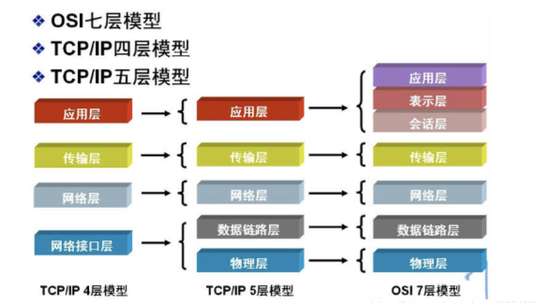
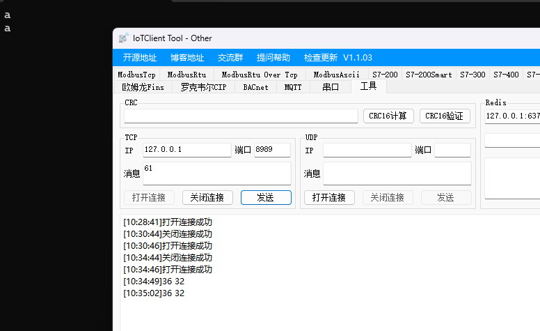
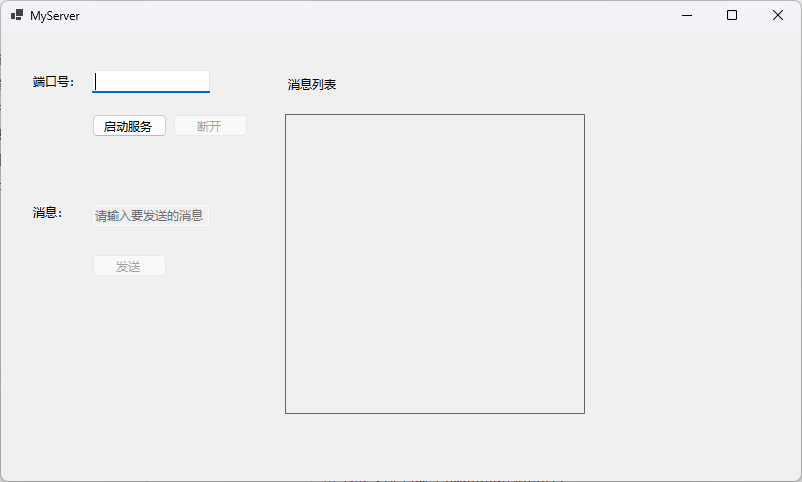
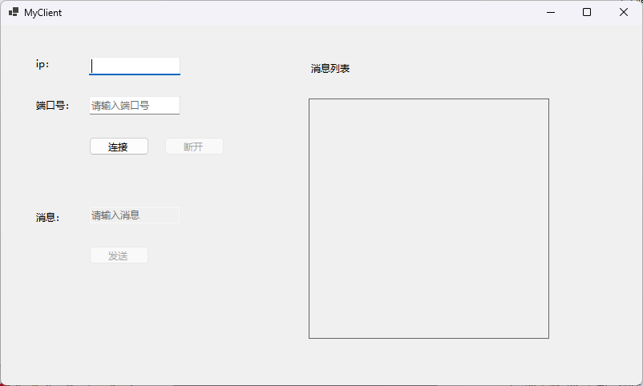
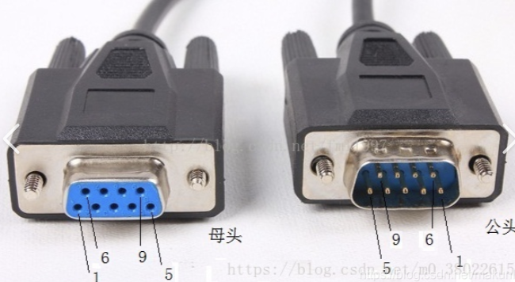
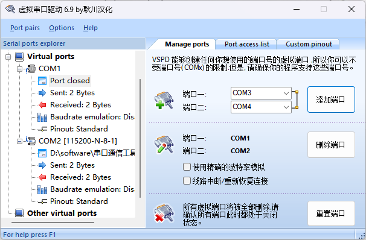
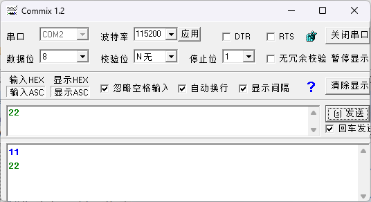

# day14

## 一、TCP通信

网络分层：

 


| 分层 | 功能                        | TCP/IP协议                                              |                      |
| ---- | --------------------------- | ------------------------------------------------------- | -------------------- |
| 7    | 应用层(Application layer)   | 用户接口，应用程序(文件传输,电子邮件,文件服务,虚拟终端) | TFTP,HTTP,SNMP,DNS等 |
| 6    | 表示层(Presentation layer)  | 数据的表示,压缩和加密(数据格式化,代码转换,数据加密)     | 没有协议             |
| 5    | 会话层(Session layer)       | 会话的建立和结束(解除或建立与别的接点的联系)            | 没有协议             |
| 4    | 传输层(Transport layer)     | 提供端对端的接口                                        | TCP,UDP              |
| 3    | 网络层(Network layer)       | 为数据包选择路由,寻址                                   | IP,ICMP,RIP,OSPF等   |
| 2    | 数据链路层(Data link layer) | 保证误差错的数据链路,传输有地址的帧,以及错误检测功能    | SLIP,CSLIP,PPP,ARP等 |
| 1    | 物理层(Physical layer)      | 传输比特流,以二进制数据形式在物理媒体上的数据           | ISO2110,IEEE802等    |


### 1、服务端

基础语法：

```c#
// TCP服务器代码
/*               
TCP代码步骤：
	1. 创建TCP服务, 设置监听对应的ip和端口号
	2. 启动TCP服务
	3. 创建(等待)客户端的对象
	4. 接收消息/发送消息
*/
string IP = "127.0.0.1";
// TCP服务创建必须传递的一个  IPAddress 类型的数据
IPAddress IPAddr = IPAddress.Parse(IP);

// 端口号: 0~65535  
int Port = 8888;
// 创建TCP服务器
TcpListener TcpServer = new TcpListener(IPAddr, Port);
// 启动TCP服务器
TcpServer.Start();

// 创建等待客户端对象
TcpClient TCPClient = TcpServer.AcceptTcpClient();

// 创建数据流(数据管道) 
NetworkStream Stream = TCPClient.GetStream();
/*
可以通过数据管道 向客户端发送数据:  数据管道.Write(字节数组的形式的数据)
也可以通过数据管道接收 客户端发送的数据: 数据管道.Read(字节数组,开始下标,长度)
	- 接收的数据流,需要分多次接收(字节数组)
		+ 服务器端也不知道客户端什么时候发送数据
			- 所以接收数据一般可以使用一个死循环,在死循中不断的获取接收的数据
*/
// 创建接收数据的字节数组
byte[] Buffer = new byte[1024];
while (true)
{   
    int Len = Stream.Read(Buffer, 0, Buffer.Length);
    // 同步阻塞代码,读取到了数据才会往下执行那个
    // 获取到连接上服务端的客户端信息
    string ClientIp = TCPClient.Client.RemoteEndPoint?.ToString();
    Console.WriteLine($"有人连接: {ClientIp}");

    // 将字节数组 转为字符串
    string ReviceData = System.Text.Encoding.UTF8.GetString(Buffer,0,Len);
    Console.WriteLine(ReviceData);
    
    // 给客户端发数据 消息
    string sendStr = "OK";
    // 字符串转为 字节数组 方便 数据管道发送数据
    byte[] SendData =  Encoding.UTF8.GetBytes(sendStr); 
    Stream.Write(SendData,0,SendData.Length); 

}
```

 

例：

```c#
using System;
using System.Collections.Generic;
using System.ComponentModel;
using System.Data;
using System.Drawing;
using System.Net;
using System.Net.Sockets;
using System.Text;
using System.Windows.Forms;
using static System.Windows.Forms.VisualStyles.VisualStyleElement;
using static System.Windows.Forms.VisualStyles.VisualStyleElement.ToolBar;

namespace day14
{
    public partial class TcpCommunication : Form
    {
        private CancellationTokenSource _cts = new CancellationTokenSource();
        private TcpListener _tcpServer;
        private TcpClient _currentClient;

        public TcpCommunication()
        {
            InitializeComponent();
            new ClientTCP().Show();
            this.Shown += TcpCommunication_Shown;
            this.FormClosing += (s, e) => StopServer();
        }

        private void TcpCommunication_Shown(object? sender, EventArgs e)
        {
            button1.Click += Button1_Click;
            button2.Click += Button3_Click; // 断开按钮
                                            
        }

        private async void Button1_Click(object? sender, EventArgs e)
        {
            // 防止重复点击
            button1.Enabled = false;

            try
            {
                string ip = textBox1.Text;
                int port = int.Parse(textBox2.Text);
                IPAddress ipAddress = IPAddress.Parse(ip);

                // 创建并启动监听
                _tcpServer = new TcpListener(ipAddress, port);
                _tcpServer.Start();

                // 等待客户端连接（可取消）
                _currentClient = await _tcpServer.AcceptTcpClientAsync(_cts.Token);

                // 处理客户端（不阻塞 UI）
                _ = HandleClientAsync(_currentClient, _cts.Token);
            }
            catch (OperationCanceledException)
            {
                // 用户主动取消，静默
            }
            catch (Exception ex)
            {
                MessageBox.Show($"连接错误: {ex.Message}");
            }
            finally
            {
                // 关闭监听（不再接受新连接）
                _tcpServer?.Stop();
                button1.Enabled = true;
            }
        }

        private async Task HandleClientAsync(TcpClient client, CancellationToken token)
        {
            string clientIp = client.Client.RemoteEndPoint?.ToString() ?? "未知";
            MessageBox.Show($"客户端 {clientIp} 已连接");

            try
            {
                using (client) // 使用完自动销毁
                using (NetworkStream stream = client.GetStream())
                {
                    byte[] buffer = new byte[1024];
                    while (!token.IsCancellationRequested)
                    {
                        // 异步读取（可取消）
                        int readLen = await stream.ReadAsync(buffer, 0, buffer.Length, token);
                        if (readLen == 0)
                        {
                            MessageBox.Show($"客户端 {clientIp} 断开连接");
                            break;
                        }

                        string received = Encoding.UTF8.GetString(buffer, 0, readLen);
                        MessageBox.Show($"收到 {clientIp}: {received}");

                        // 回复
                        byte[] response = Encoding.UTF8.GetBytes($"服务端已收到: {received}");
                        await stream.WriteAsync(response, 0, response.Length, token);
                    }
                }
            }
            catch (OperationCanceledException)
            {
                // 正常取消
            }
            catch (SocketException ex) when (ex.SocketErrorCode == SocketError.OperationAborted)
            {
                // 995 错误，忽略
            }
            catch (Exception ex)
            {
                MessageBox.Show($"处理客户端异常: {ex.Message}");
            }
        }

        private void Button3_Click(object sender, EventArgs e)
        {
            StopServer();
        }

        private void StopServer()
        {
            _cts?.Cancel();            // 取消所有异步操作
            _tcpServer?.Stop();        // 停止监听
            _currentClient?.Close();   // 关闭当前客户端（如果有）
            _currentClient = null;
            // 重新创建 CancellationTokenSource 以便再次启动
            _cts = new CancellationTokenSource();
        }
    }
}
```

### 2、客户端

语法步骤：

- 创建客户端对象

  ```c#
  // 创建tcp客户端
  TcpClient TCPClient = new TcpClient();
  ```

  

- 连接服务器

  ```c#
  // 连接，参数1：ip地址(IPAddress)   参数2：端口号(int)
  TCPClient.Connect(IPAddress.Parse("127.0.0.1"), 8989);
  ```

  

- 创建数据流

  ```c#
  // 创建数据流
  NetworkStream Stream = TCPClient.GetStream();
  ```

  

- 读取/发送数据数据

  ```c#
  // 读取数据
  byte[] Buffer = new byte[1024];
  int Len = Stream.Read(Buffer, 0, Buffer.Length);
  // 将buffer转成字符串
  string ReceiveData = System.Text.Encoding.UTF8.GetString(Buffer, 0, Len);
  MessageBox.Show(ReceiveData);
  // 发送数据
  // 获取文本框输入的字符串
  string SendData = textBox1.Text;
  // 转成字节数组
  byte[] SendBytes = System.Text.Encoding.UTF8.GetBytes(SendData);
  // 发送数据
  Stream.Write(SendBytes, 0, SendBytes.Length);
  ```

例：

```c#
using System;
using System.Collections.Generic;
using System.ComponentModel;
using System.Data;
using System.Drawing;
using System.Net.Sockets;
using System.Text;
using System.Windows.Forms;
using static System.Windows.Forms.VisualStyles.VisualStyleElement;

namespace day14
{
    public partial class ClientTCP : Form
    {
        private TcpClient _client;
        private NetworkStream _stream;
        private CancellationTokenSource _cts = new CancellationTokenSource();
        private bool _isConnected;

        public ClientTCP()
        {
            InitializeComponent();
            this.Shown += ClientTCP_Shown;
            this.FormClosing += (s, e) => Disconnect();
        }

        private void ClientTCP_Shown(object? sender, EventArgs e)
        {
            button1.Click += Button1_Click;   // 连接
            button2.Click += Button2_Click;   // 发送
                                              // 其他控件初始化...
        }

        // ---------- 连接 ----------
        private async void Button1_Click(object? sender, EventArgs e)
        {
            button1.Enabled = false;

            // 如果已经连接，先断开
            if (_isConnected)
                Disconnect();

            try
            {
                string ip = textBox1.Text;
                int port = int.Parse(textBox2.Text);

                // 重新创建 TcpClient（避免 ObjectDisposedException）
                _client = new TcpClient();
                await _client.ConnectAsync(ip, port, _cts.Token);

                _isConnected = true;
                _stream = _client.GetStream();

                // 启动接收循环
                _ = ReadDataAsync(_cts.Token);

                MessageBox.Show("连接成功");
                button1.Enabled = true;
            }
            catch (OperationCanceledException)
            {
                // 取消连接
            }
            catch (Exception ex)
            {
                MessageBox.Show($"连接失败: {ex.Message}");
                button1.Enabled = true;
            }
        }

        // ---------- 发送 ----------
        private async void Button2_Click(object? sender, EventArgs e)
        {
            if (!_isConnected || _stream == null)
            {
                MessageBox.Show("未连接，无法发送");
                return;
            }

            string content = textBox3.Text;
            if (string.IsNullOrWhiteSpace(content)) return;

            byte[] buffer = Encoding.UTF8.GetBytes(content);
            try
            {
                await _stream.WriteAsync(buffer, 0, buffer.Length, _cts.Token);
                textBox3.Clear();
            }
            catch (OperationCanceledException)
            {
                // 发送被取消
            }
            catch (Exception ex)
            {
                MessageBox.Show($"发送失败: {ex.Message}");
            }
        }

        // ---------- 接收循环 ----------
        private async Task ReadDataAsync(CancellationToken token)
        {
            byte[] buffer = new byte[4096];
            try
            {
                while (!token.IsCancellationRequested && _isConnected && _stream != null)
                {
                    // 使用带取消的 ReadAsync
                    int len = await _stream.ReadAsync(buffer, 0, buffer.Length, token);
                    if (len == 0)
                    {
                        MessageBox.Show("服务器断开连接");
                        break;
                    }

                    string msg = Encoding.UTF8.GetString(buffer, 0, len);
                    MessageBox.Show($"收到消息: {msg}");
                }
            }
            catch (OperationCanceledException)
            {
                // 正常取消
            }
            catch (SocketException ex) when (ex.SocketErrorCode == SocketError.OperationAborted)
            {
                // 995，忽略
            }
            catch (Exception ex)
            {
                MessageBox.Show($"接收异常: {ex.Message}");
            }
            finally
            {
                // 如果连接意外断开，更新状态
                if (_isConnected)
                {
                    _isConnected = false;
                    _stream?.Close();
                    _stream = null;
                    _client?.Close();
                    _client = null;
                }
            }
        }

        // ---------- 断开 ----------
        private void Disconnect()
        {
            _cts?.Cancel();        // 取消所有操作
            _stream?.Close();
            _stream = null;
            _client?.Close();
            _client = null;
            _isConnected = false;
            // 重新创建 CancellationTokenSource
            _cts = new CancellationTokenSource();
            button1.Enabled = true;
        }

        // 可以给断开按钮调用 Disconnect()
        private void Button3_Click(object sender, EventArgs e) => Disconnect();
    }
}
```

### 3、简易聊天室

服务器 <==> 客户端，只有收发消息，建立连接的功能

服务器端：

```c#
using System;
using System.Collections.Generic;
using System.ComponentModel;
using System.Data;
using System.Drawing;
using System.Net;
using System.Net.Sockets;
using System.Text;
using System.Windows.Forms;
using static System.Windows.Forms.VisualStyles.VisualStyleElement;

namespace TCPCLIENT
{
    public partial class MyServer : Form
    {
        public MyServer()
        {
            InitializeComponent();
            // 当前窗体显示的时候让另一个客户端窗体也显示
            this.Shown += MyServer_Shown;
        }

        private void MyServer_Shown(object? sender, EventArgs e)
        {
            // 让客户端窗体也打开
            new MyClient().Show();
            // 点击启动的时候创建服务器
            button1.Click += Button1_Click;
            // 点击发送消息的按钮给客户端发送消息
            button2.Click += Button2_Click;
            // 输入消息的文本框应该禁用
            textBox2.Enabled = false;
            button3.Enabled = false;
            button3.Click += Button3_Click;
        }

        private void Button3_Click(object? sender, EventArgs e)
        {
            if (!IsConnected)
            {
                IsConnected = false;
                MessageBox.Show("还没有连接");
                return;
            }
            if (Stream == null)
            {
                IsConnected = false;
                MessageBox.Show("还没有数据流");
                return;
            }
            TCPServer.Stop();
            IsConnected = false;
            TCPServer = null;
            Stream = null;
        }

        private async void Button2_Click(object? sender, EventArgs e)
        {
            if (!IsConnected)
            {
                IsConnected = false;
                MessageBox.Show("还没有连接");
                return;
            }
            if (Stream == null)
            {
                IsConnected = false;
                MessageBox.Show("还没有数据流");
                return;
            }
            // 获取输入消息
            string Message = textBox2.Text;
            //MessageBox.Show(Message);
            // 转成byte数组
            byte[] SendData = System.Text.Encoding.UTF8.GetBytes(Message);
            try
            {
                // 给数据流写入数据
                await Stream.WriteAsync(SendData, 0, SendData.Length);
            } catch(Exception err)
            {
                IsConnected = false;
                MessageBox.Show($"出错了，错误是：{err.Message}");
            }
            textBox2.Text = "";
        }

        private NetworkStream Stream;
        private bool IsConnected;
        private TcpListener TCPServer;
        private async void Button1_Click(object? sender, EventArgs e)
        {
            button1.Enabled = false;
            // 接收端口号
            string Port = textBox1.Text;
            bool isSuccess = int.TryParse(Port, out int IntPort);
            if (!isSuccess)
            {
                IsConnected = false;
                MessageBox.Show("请输入正确的端口号！");
                return;
            }
            // 创建服务器
            TCPServer = new TcpListener(IPAddress.Any, IntPort);
            // 开启服务器
            TCPServer.Start();
            IsConnected = true;
            // 输出已经连接
            MessageBox.Show("服务器已经启动");
            // 输入框禁用
            textBox1.Enabled = false;
            button3.Enabled = true;
            TcpClient TCPClient;
            try
            {
                // 准备接收数据
                TCPClient = await TCPServer.AcceptTcpClientAsync();
                // 输出客户端连接：
                MessageBox.Show($"有客户端连接，ip是：{TCPClient.Client.RemoteEndPoint}");
                // 创建数据流
                Stream = TCPClient.GetStream();
            } catch(Exception err)
            {
                // 关闭连接
                TCPServer.Stop();
                IsConnected = false;
                MessageBox.Show($"出错了，错误是：{err.Message}");
            }
            // 有客户端连接了，才能输入消息
            textBox2.Enabled = true;
            // 让另一个方法去读取数据接收
            ReadData();
        }
        private async void ReadData()
        {
            
            if (!IsConnected)
            {
                IsConnected = false;
                MessageBox.Show("还没有连接");
                return;
            }
            if (Stream == null)
            {
                IsConnected = false;
                MessageBox.Show("还没有数据流");
                return;
            }
            int Num = 0;
            // 准备字节数组
            byte[] Buffer = new byte[1024];
            while(true)
            {
                // 从数据流中读取数据放在buffer中
                int Len = await Stream.ReadAsync(Buffer, 0, Buffer.Length);
                // 判断如果读取长度为0，就表示关闭了
                if (Len == 0)
                {
                    IsConnected = false;
                    MessageBox.Show("对方已经断开");
                    break;
                }
                // 转成字符串
                string Data = System.Text.Encoding.UTF8.GetString(Buffer, 0, Len);
                // 创建label，放在panel中
                Label Lb = new Label();
                Lb.Text = Data;
                Lb.AutoSize = false;
                Lb.Size = new Size(300, 30) ;
                Lb.Location = new Point(0, Num * 30);
                panel1.Controls.Add(Lb);
                Num++;

                MessageBox.Show("接收到消息了");
            }
        }
    }
}

```

界面：

 

客户端：

```c#
using System;
using System.Collections.Generic;
using System.ComponentModel;
using System.Data;
using System.Drawing;
using System.Net;
using System.Net.Sockets;
using System.Text;
using System.Windows.Forms;
using static System.Runtime.InteropServices.JavaScript.JSType;

namespace TCPCLIENT
{
    public partial class MyClient : Form
    {
        public MyClient()
        {
            InitializeComponent();
            this.Shown += MyClient_Shown;
        }

        private void MyClient_Shown(object? sender, EventArgs e)
        {
            // 点击按钮，连接
            button1.Click += Button1_Click;
            // 发消息
            button2.Click += Button2_Click;
            textBox3.Enabled = false;
            button2.Enabled = false;
            button3.Enabled = false;
            button3.Click += Button3_Click;
        }

        private void Button3_Click(object? sender, EventArgs e)
        {
            if (!IsConnect)
            {
                MessageBox.Show("没有连接");
                IsConnect = false;
                return;
            }
            if (Stream == null)
            {
                MessageBox.Show("没有数据流");
                IsConnect = false;
                return;
            }
            // 关闭连接
            TCPClient.Close();
            IsConnect = false;
            TCPClient = null;
            Stream = null;
        }

        private async void Button2_Click(object? sender, EventArgs e)
        {
            // 获取消息
            string Message = textBox3.Text;
            if (!IsConnect)
            {
                MessageBox.Show("没有连接");
                IsConnect = false;
                return;
            }
            if (Stream == null)
            {
                MessageBox.Show("没有数据流");
                IsConnect = false;
                return;
            }
            // 转数据
            byte[] SendData = System.Text.Encoding.UTF8.GetBytes(Message);
            try
            {
                await Stream.WriteAsync(SendData, 0, SendData.Length);
            }
            catch(Exception err)
            {
                IsConnect = false;
                MessageBox.Show("发送失败");
                return;
            }
            textBox3.Text = "";
        }

        private NetworkStream Stream;
        private bool IsConnect;
        private TcpClient TCPClient;
        private async void Button1_Click(object? sender, EventArgs e)
        {
            button1.Enabled = false;
            // 接收ip和端口号
            string Ip = textBox1.Text;
            string Port = textBox2.Text;
            bool IsIP = IPAddress.TryParse(Ip, out IPAddress IPAddr);
            bool IsPort = int.TryParse(Port, out int ConnPort);
            if (!IsIP || !IsPort)
            {
                MessageBox.Show("请输入正确的ip和端口号");
                return;
            }
            // 创建客户端对象
            TCPClient = new TcpClient();
            try {
                // 连接
                await TCPClient.ConnectAsync(IPAddr, ConnPort);
                IsConnect = true;
                // 创建数据流
                Stream = TCPClient.GetStream();
            } catch(Exception err)
            {
                IsConnect = false;
                MessageBox.Show("连接错误");
                return;
            }
            // 输出连接成功
            MessageBox.Show("连接成功");
            // 让输入框禁用
            textBox1.Enabled = false;
            textBox2.Enabled = false;
            textBox3.Enabled = true;
            button3.Enabled = true;
            button2.Enabled = true;
            // 处理读取数据
            ReadData();
        }
        private int Num = 0;
        private async void ReadData()
        {
            if (!IsConnect)
            {
                MessageBox.Show("没有连接");
                IsConnect = false;
                return;
            }
            if (Stream == null)
            {
                MessageBox.Show("没有数据流");
                IsConnect = false;
                return;
            }
            // 创建byte数组
            byte[] Buffer = new byte[1024];
            while(true)
            {
                // 读取数据
                int Len = await Stream.ReadAsync(Buffer, 0, Buffer.Length);
                if (Len == 0)
                {
                    IsConnect = false;
                    MessageBox.Show("连接断开");
                    break;
                }
                // 转字符串
                string ReceiveData = System.Text.Encoding.UTF8.GetString(Buffer);
                // 放在label中
                // 创建label，放在panel中
                Label Lb = new Label();
                Lb.Text = ReceiveData;
                Lb.AutoSize = false;
                Lb.Size = new Size(300, 30);
                Lb.Location = new Point(0, Num * 30);
                panel1.Controls.Add(Lb);
                Num++;
                MessageBox.Show("接收到消息了");
            }
        }
    }
}
```

界面：

 

作业：群聊聊天室（1个服务器，多个客户端，客户端发消息，服务器收到，给所有客户端发消息）

## 二、串口通信

 

安装虚拟串口模拟器。

 

打开窗口通信工具，模拟COM1和COM2通信：

 

安装第三方包：`System.IO.Ports`

基本语法：

```c#
// 创建串口对象
SerialPort MyPort = new SerialPort("COM1", 115200, Parity.None, 8, StopBits.One);
// 打开串口
MyPort.Open();
// 通过串口对象创建数据流
var Stream = MyPort.BaseStream;
// 接收读取数据
byte[] Buffer = new byte[1024];
while(true)
{
    // 通过数据流读取数据
    int Len = Stream.Read(Buffer, 0, Buffer.Length);
    // 转字符串
    string ReceiveData = System.Text.Encoding.UTF8.GetString(Buffer, 0, Len);
    MessageBox.Show(ReceiveData);

    // 回复数据
    string SendString = "33";
    byte[] SendBytes = System.Text.Encoding.UTF8.GetBytes(SendString);
    Stream.Write(SendBytes, 0, SendBytes.Length);
}
```

例：我们的程序跟模拟串口通信工具进行聊天

```c#
public MySerialPorts()
{
    InitializeComponent();
    this.Shown += MySerialPorts_Shown;
}

private void MySerialPorts_Shown(object? sender, EventArgs e)
{
    button1.Click += Button1_Click;
    
}
private SerialPort MyPorts;
private Stream MyStream;
private void Button1_Click(object? sender, EventArgs e)
{
    // 创建串口对象
    MyPorts = new SerialPort("COM1", 9600, Parity.None, 8, StopBits.One);
    // 打开
    MyPorts.Open();
    MessageBox.Show("串口已经打开");
    button2.Click += Button2_Click;
    // 创建数据流
    MyStream = MyPorts.BaseStream;
    // 读取数据
    ReadData();
}
private int Num = 0;
private async void ReadData()
{
    // 创建字节数组
    byte[] Buffer = new byte[1024];
    // 循环读取数据
    while(true)
    {
        // 读取
        int Len = await MyStream.ReadAsync(Buffer, 0, Buffer.Length);
        if (Len == 0)
        {
            MessageBox.Show("已经断开");
            break;
        }
        // 转换类型
        string Data = System.Text.Encoding.UTF8.GetString(Buffer, 0, Len);
        // 创建label
        // 创建label，放在panel中
        Label Lb = new Label();
        Lb.Text = Data;
        Lb.AutoSize = false;
        Lb.Size = new Size(300, 30);
        Lb.Location = new Point(0, Num * 30);
        panel1.Controls.Add(Lb);
        Num++;

        MessageBox.Show("接收到消息了");

    }
}

private async void Button2_Click(object? sender, EventArgs e)
{
    if (!MyPorts.IsOpen)
    {
        MessageBox.Show("串口未打开");
        return;
    }
    if (MyStream == null)
    {
        MessageBox.Show("没有数据流");
        return;
    }
    // 接收输入的消息
    string Message = textBox1.Text;
    // 转成字节数组
    byte[] SendBytes = System.Text.Encoding.UTF8.GetBytes(Message);
    try
    {
        // 发送
        await MyStream.WriteAsync(SendBytes, 0, SendBytes.Length);
    }
    catch(Exception err)
    {
        MessageBox.Show("发送失败");
        return;
    }
}
```

严谨的写法：

```c#
public SeriaPortCommucation1()
{
    InitializeComponent();
    this.Shown += SeriaPortCommucation1_Shown;
    this.FormClosing += SeriaPortCommucation1_FormClosing;
    new SeriaPortCommucation2().Show();
}

private void SeriaPortCommucation1_FormClosing(object? sender, FormClosingEventArgs e)
{
    isopen = false;

    if (cts != null)
    {
        cts.Cancel();
        cts.Dispose();
        cts = null;
    }
    if (seria != null)
    {
        if (seria.IsOpen)
        {
            seria.Close();
        }
        seria.Dispose();
    }
}

private void SeriaPortCommucation1_Shown(object? sender, EventArgs e)
{
    seria = new SerialPort("COM1", 9600, Parity.Even, 8, StopBits.One);
    cts = new CancellationTokenSource();
    button1.Click += Button1_Click;
    button2.Click += Button2_Click;
}

private async void Button2_Click(object? sender, EventArgs e)
{
    string text = textBox1.Text;
    var stream = seria.BaseStream;
    byte[] data = Encoding.UTF8.GetBytes(text);
    await stream.WriteAsync(data, 0, data.Length, cts.Token);
}

private SerialPort seria;
private CancellationTokenSource cts;
private bool isopen;
private async void Button1_Click(object? sender, EventArgs e)
{
    if(isopen)
    {
        MessageBox.Show("串口已经打开");
        return;
    }
    try
    {
        seria.Open();
        isopen = true;
        // 等待接收数据
        await ReceiveData(cts.Token);
    }
    catch (UnauthorizedAccessException)
    {
        throw new Exception("串口被其他程序占用，无法打开");
    }
    catch (System.IO.IOException)
    {
        throw new Exception("COM1不存在，请检查串口设备是否插入");
    }
    catch (Exception ex)
    {
        throw new Exception($"打开串口异常：{ex.Message}", ex);
    }
}
private async Task ReceiveData(CancellationToken token)
{
    byte[] buffer = new byte[4096];
    var stream = seria.BaseStream;
    try
    {
        while(!token.IsCancellationRequested && isopen)
        {
            int Len = await stream.ReadAsync(buffer, 0, buffer.Length, token);
            if (Len == 0)
            {
                MessageBox.Show("串口流断开");
                break;
            }
            string data = Encoding.UTF8.GetString(buffer);
            MessageBox.Show(data);
        }
    }catch(Exception err)
    {
        MessageBox.Show(err.Message);
    }
}
```


## 三、ModBus

modbus分为三种通信方式，分别是串口的ModbusRTU和ModbusASCII以及TCP。

modbus分主站从站，我们的代码属于主站，对指定的从站进行读写操作。

每个从站都有自己的id地址，在通信的时候需要选择指定的从站；每个从站都有4个数据存储区，分别代表不同的功能，这4个存储区分为：线圈状态、输入线圈（只读）、保持型寄存器、输入寄存器（只读）。

代码使用Modbus通信，需要安装第三方库：NModbus4

语法：

ModbusRTU：

```c#
SerialPort seria = new SerialPort("COM1", 9600, Parity.None, 8, StopBits.One);
seria.Open();
IModbusSerialMaster master = ModbusSerialMaster.CreateRtu(seria);
master.Transport.ReadTimeout = 2000; // 读超时
master.Transport.Retries = 3; // 重试次数
// 从站1、保持寄存器，0-9
//ushort[] registers = master.ReadHoldingRegisters(
//    slaveAddress: 1, // 从站地址1-247
//    startAddress: 0, // 开始地址
//    numberOfPoints: 3 // 读取数量
//);

// 输入寄存器
//ushort[] registers = master.ReadInputRegisters(
//    slaveAddress: 1, // 从站地址1-247
//    startAddress: 0, // 开始地址
//    numberOfPoints: 3 // 读取数量
//);

// 线圈状态
//bool[] registers = master.ReadCoils(1, 0, 5);

// 输入线圈
//bool[] registers = master.ReadInputs(1, 0, 5);
//MessageBox.Show(string.Join(", ", registers));

// 线圈状态，给单个地址写入数据
//master.WriteSingleCoil(1, 2, true);

// 线圈状态，批量写入数据，从站地址，开始地址，数据
//master.WriteMultipleCoils(1, 3, new bool[] {true, true});
//bool[] registers = master.ReadCoils(1, 0, 5);
//MessageBox.Show(string.Join(", ", registers));

// 保持型寄存器，给单个地址写入数据
//master.WriteSingleRegister(1, 3, 1234);

// 保持型寄存器，批量写入数据
master.WriteMultipleRegisters(1, 2, new ushort[] {33,33,33,33});
ushort[] registers = master.ReadHoldingRegisters(
    slaveAddress: 1, // 从站地址1-247
    startAddress: 0, // 开始地址
    numberOfPoints: 5 // 读取数量
);
MessageBox.Show(string.Join(", ", registers));
```

modbusACI（不常用）

```c#
SerialPort seria = new SerialPort("COM1", 9600, Parity.None, 8, StopBits.One);
seria.Open();
IModbusSerialMaster master = ModbusSerialMaster.CreateAscii(seria);
master.Transport.ReadTimeout = 2000; // 读超时
master.Transport.Retries = 3; // 重试次数
// 从站1、保持寄存器，0-9
//ushort[] registers = master.ReadHoldingRegisters(
//    slaveAddress: 1, // 从站地址1-247
//    startAddress: 0, // 开始地址
//    numberOfPoints: 3 // 读取数量
//);

// 输入寄存器
//ushort[] registers = master.ReadInputRegisters(
//    slaveAddress: 1, // 从站地址1-247
//    startAddress: 0, // 开始地址
//    numberOfPoints: 3 // 读取数量
//);

// 线圈状态
//bool[] registers = master.ReadCoils(1, 0, 5);

// 输入线圈
//bool[] registers = master.ReadInputs(1, 0, 5);
//MessageBox.Show(string.Join(", ", registers));

// 线圈状态，给单个地址写入数据
//master.WriteSingleCoil(1, 2, true);

// 线圈状态，批量写入数据，从站地址，开始地址，数据
//master.WriteMultipleCoils(1, 3, new bool[] {true, true});
//bool[] registers = master.ReadCoils(1, 0, 5);
//MessageBox.Show(string.Join(", ", registers));

// 保持型寄存器，给单个地址写入数据
//master.WriteSingleRegister(1, 3, 1234);

// 保持型寄存器，批量写入数据
master.WriteMultipleRegisters(1, 2, new ushort[] {33,33,33,33});
ushort[] registers = master.ReadHoldingRegisters(
    slaveAddress: 1, // 从站地址1-247
    startAddress: 0, // 开始地址
    numberOfPoints: 5 // 读取数量
);
MessageBox.Show(string.Join(", ", registers));
```

Tcp：

```c#
TcpClient c = new TcpClient();
c.Connect(IPAddress.Any, 502);
// 创建tcp的Modbus对象
IModbusMaster master = ModbusIpMaster.CreateIp(c);
// 读取写入数据存储区的代码是相同的
```


