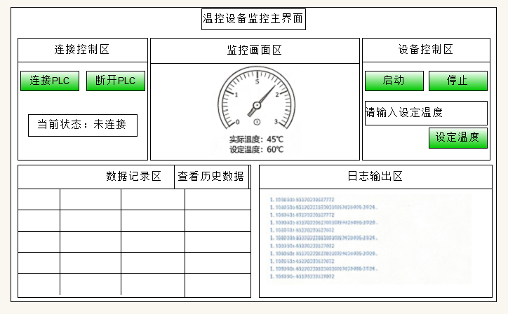
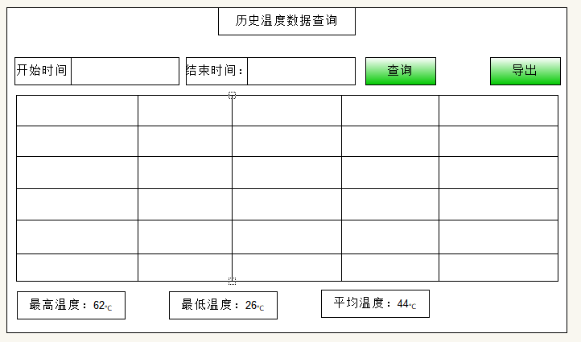

# day16

## 温控设备监控项目

### 界面设计



**子窗体**



> 静态界面在资料文件件夹,可以参考

### 项目说明

> 项目基于 WinForms 的温控设备数据采集与管理系统。通过 Modbus RTU 串口协议读取温控设备寄存器，实现温度实时监控、启停控制、数据定时入库、历史查询统计与 JSON 导出

- **主界面 ：**设备连接、实时监控、采集记录、温控模拟、数据入库、操作日志；
- **历史查询界面：**按时间范围查询、温度统计、JSON 导出。由主窗体"历史数据查询"按钮打开


### 界面参考

#### 表格参考
| 采集时间   | 设备状态 | 设定温度 | 实际温度 | 故障码 |
| ---------- | -------- | -------- | -------- | ------ |
| 2026-08-25 | 1        | 60       | 42       | 0      |
| 2026-08-26 | 1        | 60       | 42       | 0      |
| 2026-08-27 | 1        | 60       | 42       | 0      |

#### 日志参考

##### 日志记录		
1. 连接设备成功，开始采集		
2. 断开设备，停止采集		
3. 设备置运行状态		
4. 设备置待机状态		
5. 设置目标温度=XX℃	
6. 【警告】发生超温故障，实际温度=XX，目标温度=XX		
7. 超温故障已消除		


### Modbus寄存器说明

| 寄存器类型                     | 寄存器地址 | 含义         | 访问权限 | 说明                                          |
| ------------------------------ | ---------- | ------------ | -------- | --------------------------------------------- |
| 保持寄存器（Holding Register） | 0          | 设备状态     | 读/写    | 0待机，1运行，2故障；上位机按钮可以写此寄存器 |
| 保持寄存器（Holding Register） | 1          | 设定温度     | 读/写    | 上位机设置目标温度，写这个寄存器              |
| 保持寄存器（Holding Register） | 2          | 实际采集温度 | 读/写    | PLC / 仿真软件内部自动变化，上位机不能写      |
| 保持寄存器（Holding Register） | 3          | 故障码       | 读/写    | 0   无故障，1 超温，PLC 内部生成              |
### 界面温度及记录说明
- 主页数据每隔500ms给DataGridView记录一次				
- 子页数据每隔3000ms给数据库记录一次				
- 设备启动后，设定温度保存在寄存器，实际温度使用定时器每隔500ms给寄存器写数据，接近实际温度	
- 当超温时警告即可，不用停止设备，给寄存器写入1	


### 数据库说明

#### 数据库数据示例

| Id   | CollectTime           | DeviceStatus | SetTemp | RealTemp | FaultCode |
| ---- | --------------------- | ------------ | ------- | -------- | --------- |
| 1    | 2026‑08‑25   18:10:03 | 1            | 60      | 44       | 0         |
| 2    | 2026‑08‑25   18:10:06 | 1            | 60      | 50       | 1         |

#### 数据库Sql

```sql
CREATE TABLE DeviceTempRecord (
    Id INT AUTO_INCREMENT PRIMARY KEY COMMENT '自增主键',
    CollectTime DATETIME NOT NULL DEFAULT CURRENT_TIMESTAMP COMMENT '数据快照采集时间',
    DeviceStatus INT NOT NULL COMMENT '设备状态 0待机 1运行 2故障',
    SetTemp INT NOT NULL COMMENT '目标设定温度',
    RealTemp INT NOT NULL COMMENT '实际温度',
    FaultCode INT NOT NULL COMMENT '故障码 0无故障 1超温故障'
) COMMENT='温控设备历史快照记录表';
```

#### 数据模型实现

>  为了完成界面数据的复杂绑定, 根据数据库表 实现数据模型创建

```C#
internal class DeviceTempRecord: INotifyPropertyChanged
{

    public event PropertyChangedEventHandler PropertyChanged;
    private DateTime _CollectTime { get; set; }
    public DateTime CollectTime
    {
        get
        {
            return _CollectTime;
        }
        set
        {
            _CollectTime = value;
            PropertyChanged?.Invoke(this, new PropertyChangedEventArgs(nameof(CollectTime)));
        }
    }

    private ushort _DeviceStatus { get; set; }
    public ushort DeviceStatus
    {
        get
        {
            return _DeviceStatus;
        }
        set
        {
            _DeviceStatus = value;
            PropertyChanged?.Invoke(this, new PropertyChangedEventArgs(nameof(DeviceStatus)));
        }
    }
    private ushort _SetTemp { get; set; }
    public ushort SetTemp
    {
        get
        {
            return _SetTemp;
        }
        set
        {
            _SetTemp = value;
            PropertyChanged?.Invoke(this, new PropertyChangedEventArgs(nameof(SetTemp)));
        }
    }
    private ushort _RealTemp { get; set; }
    public ushort RealTemp
    {
        get
        {
            return _RealTemp;
        }
        set
        {
            _RealTemp = value;
            PropertyChanged?.Invoke(this, new PropertyChangedEventArgs(nameof(RealTemp)));
        }
    }
    private ushort _FaultCode { get; set; }
    public ushort FaultCode
    {
        get
        {
            return _FaultCode;
        }
        set
        {
            _FaultCode = value;
            PropertyChanged?.Invoke(this, new PropertyChangedEventArgs(nameof(FaultCode)));
        }
    }
    internal DeviceTempRecord(ushort[] dataInRegeRegister)
    {
        CollectTime = DateTime.Now;
        this.DeviceStatus = dataInRegeRegister[0];
        this.SetTemp = dataInRegeRegister[1];
        this.RealTemp = dataInRegeRegister[2];
        this.FaultCode = dataInRegeRegister[3];
    }

}
```

### 功能详细说明及实现

### 界面初始化

**功能描述：**项目启动则初始化界面,表头设置,禁用UI设置,事件绑定,表盘绘制等

#### **定义字段数据**:

```C#
/************************************/
// 定义数据
private BindingList<DeviceTempRecord> DTRs; // 表格数据
private SerialPort MyPort; // 串口对象
private IModbusSerialMaster Master; // 主站串口
private System.Windows.Forms.Timer TempTimer;// 温度定时器(用于模拟温度变化)
private System.Windows.Forms.Timer DataTimer; // 数据记录定时器(用于定时记录数据)
private bool isHeating = true;     //温度变化模拟 true=升温, false=降温
private int RecordeDataBase = 0; // 主页数据每隔500ms记录  每隔3000ms数据库记录,可以使用计数器,6次则写入数据库
/************************************/
```

#### **初始化实现**

```C#
private void TCMInit(object sender, EventArgs e)
{
    // 初始化相关内容
    // 设置按钮,输入框禁用UI
    closePLCBtn.Enabled = false;// 断开连接按钮
    startBtn.Enabled = false; // 设备启动按钮
    stopBtn.Enabled = false; // 设备停止按钮
    setTempBtn.Enabled = false; // 设定温度按钮

    // 温度定时器和数据记录定时器设置, 并修改UI禁用
    TempTimer = new();// 模拟温度升温变化 (在设备启动后才开始)
    TempTimer.Interval = 400;
    TempTimer.Tick += TempMoni;

    DataTimer = new(); // 数据记录定时器(设备启动后才开始)
    DataTimer.Interval = 500;
    DataTimer.Tick += DataRecord;

    // 准备表格数据, 预备好数据模型 DeviceTempRecode
    // 定义私有表格数据源,BindingList<DeviceTempRecode>
    // 调用设置表格表头方法
    SetDataColumns();
    // 温度表盘绘制事件
    tempPanel.Paint += TempPaint;
    // 按钮绑定事件
    connPLCBtn.Click += ConnectPLC;
    setTempBtn.Click += SetTemp;
    startBtn.Click += StartDevice;
    stopBtn.Click += StopDevice;
    closePLCBtn.Click += ClosePLC;
}
```

#### **表格初始化**

> 设置表头及表格设置等

```C#
///初始化表格/// 
private void SetDataColumns()
{
    DTRs = new(); // 初始化空数据
    // 设置自动创建表头
    dataGridView1.AutoGenerateColumns = false;
    // 设置表格数据源
    dataGridView1.DataSource = DTRs;
    // 自定义表头
    dataGridView1.Columns.Add(new DataGridViewTextBoxColumn()
    {
        DataPropertyName = "CollectTime",
        Name = "采集时间",
        DefaultCellStyle = new DataGridViewCellStyle()
        {
            Format = "yyyy-MM-dd HH:mm:ss",
            Alignment = DataGridViewContentAlignment.MiddleCenter,
        }
    });
    dataGridView1.Columns.Add(new DataGridViewTextBoxColumn()
    {
        DataPropertyName = "DeviceStatus",
        Name = "设备状态",
        DefaultCellStyle = new DataGridViewCellStyle()
        {
            Alignment = DataGridViewContentAlignment.MiddleCenter,
        }
    });
    dataGridView1.Columns.Add(new DataGridViewTextBoxColumn()
    {
        DataPropertyName = "SetTemp",
        Name = "设定温度",
        DefaultCellStyle = new DataGridViewCellStyle()
        {
            Alignment = DataGridViewContentAlignment.MiddleCenter,
        }
    });
    dataGridView1.Columns.Add(new DataGridViewTextBoxColumn()
    {
        DataPropertyName = "RealTemp",
        Name = "实际温度",
        DefaultCellStyle = new DataGridViewCellStyle()
        {
            Alignment = DataGridViewContentAlignment.MiddleCenter,
        }
    });
    dataGridView1.Columns.Add(new DataGridViewTextBoxColumn()
    {
        DataPropertyName = "FaultCode",
        Name = "故障码",
        DefaultCellStyle = new DataGridViewCellStyle()
        {
            Alignment = DataGridViewContentAlignment.MiddleCenter,
        }
    });
    // 设置宽度Fill,自动填充
    dataGridView1.AutoSizeColumnsMode = DataGridViewAutoSizeColumnsMode.Fill;
    // 设置表格行头
    dataGridView1.RowHeadersVisible = false;
    // 设置表格自读
    dataGridView1.ReadOnly = true;
    // 设置表格不可删除
    dataGridView1.AllowUserToAddRows = false;
    dataGridView1.AllowUserToDeleteRows = false;
}
```


### 设备连接与断开及操作日志

**功能描述：**建立与 Modbus 温控设备的串口连接并初始化寄存器；断开时释放串口资源。在主窗体右下日志框滚动展示操作记录。

**操作方式：**

1. 点击主窗体"连接设备"按钮：打开串口 COM1（9600，无校验），创建 Modbus RTU 主站，设置读超时 2000ms、重试 3 次；
2. 自动初始化寄存器：寄存器 0=0（空闲）、寄存器 2=24（默认温度）、寄存器 3=0（无故障）；
3. 界面切换：连接按钮禁用、断开/设置温度按钮启用，状态标签显示"已连接"，日志写入"设备连接成功，开始采集"；
4. 点击"断开连接"：关闭串口、清空主站，两个定时器停止，按钮状态还原，日志写入"断开设备，停止采集"。
5. 自动记录；日志格式为"时间戳 + 消息"。覆盖连接成功/断开、启动/停止、设定温度、故障告警与恢复等。

#### 日志实现

```C#
///日志区输出
private void WriteLog(string msg)
{
    //创建label
    Label lab = new();
    lab.Text = DateTime.Now.ToString() + " : " + msg;
    lab.AutoSize = true;
    lab.ForeColor = Color.Black;
    if (msg.Contains("警告")) lab.ForeColor = Color.Red;
    flowLayoutPanel1.Controls.Add(lab);
}
```

#### 设备连接

> 前置操作:  使用 串口模拟工具 添加一对串口模拟PLC通信
>
> > 使用 Modbus Slave 工具连接一个串口连接COM2作为Modbus的从站, 并使用保持寄存器 模拟PLC,代码端的Modbus都是主站
>
> 注意: 使用ModbusRTU 串口模拟操作PLC温度监测,需要先安装NModbus4和System.IO.Ports第三方包

```C#
private void ConnectPLC(object sender, EventArgs e)
{
    if (MyPort != null) return;
    try
    {
        // 创建串口对象
        MyPort = new SerialPort("COM1", 9600, Parity.None, 8, StopBits.One);
        MyPort.Open();
        Master = ModbusSerialMaster.CreateRtu(MyPort);
        Master.Transport.ReadTimeout = 2000; // 读超时
        Master.Transport.Retries = 3; // 重试次数
                                      // 从站id为1, 保持寄存器
        Master.WriteSingleRegister(1, 0, 0);// 初始设备状态 0 (待机)
        // 寄存器地址1 设定温度,需要界面填写设置
        Master.WriteSingleRegister(1, 2, 25);// 初始设备实际温度模拟 25 
        Master.WriteSingleRegister(1, 3, 0);// 初始故障码 0 (无故障)
    }
    catch (Exception err)
    {
        MyPort = null;
        Master = null;
        Console.WriteLine($"连接异常，请重试！异常:{err.Message}");
        return;
    }
    // 设置按钮禁用UI
    closePLCBtn.Enabled = true;// 断开PLC连接按钮
    setTempBtn.Enabled = true; // 设定温度按钮
    connPLCBtn.Enabled = false;// 连接PLC按钮
    // 修改状态
    plcStatusLabel.Text = "当前状态: 已连接";
    plcStatusLabel.ForeColor = Color.Green;
    // 日志区输出
    WriteLog("连接设备成功，开始采集");
}
```

#### 关闭设备连接

> 点击"断开连接"：关闭串口、清空主站，两个定时器停止，按钮状态还原，日志写入"断开设备，停止采集"。

```C#
private void ClosePLC(object? sender, EventArgs e)
{
    //关闭所有
    MyPort.Close();
    MyPort = null;
    Master = null;
    DataTimer.Stop();
    TempTimer.Stop();

    //连接断开后连接按钮打开，断联关闭
    connPLCBtn.Enabled = true;
    closePLCBtn.Enabled = false;            
    startBtn.Enabled = false;
    stopBtn.Enabled = false;
    setTempBtn.Enabled = false;
    plcStatusLabel.Text = "当前状态 : 未连接";            
    Console.WriteLine("所有已断开");
	WriteLog("断开设备，停止采集");
}
```

### 实时温度监控

**功能描述：**通过半圆仪表盘（量程 0~600℃，每 50℃ 一个刻度文字）实时显示设备实际温度，指针随温度变化摆动。

**操作方式：**连接并启动设备后自动运行，无需手动操作；由温控模拟定时器每 400ms 触发面板重绘。

#### 温度表盘绘制

```C#
///画图事件方法///
private void TempPaint(object sender, PaintEventArgs e)
{
    // 获取画图对象
    Graphics g = e.Graphics;
    //设置抗锯齿
    g.SmoothingMode = System.Drawing.Drawing2D.SmoothingMode.HighQuality;
    using (var pen = new Pen(Color.Green, 2))
    {
        //圆弧矩形起点
        float sx = 0;
        float sy = 0;
        float r = 140;//半径
        float locationX = sx + r;
        float locationY = sy + r;
        //画个弧
        g.DrawArc(pen, sx, sy, (float)r * 2, (float)r * 2, 180, 180);
        // 温度0~600° ===>  分为120次  温度5度一个刻度
        for (int i = 0; i <= 120; i++)
        {
            var lineLen = 5;
            if (i % 10 == 0) lineLen = 10;
            //开始结束坐标  1.5====>180度/120份,每个刻度是角度1.5
            double startX = locationX - r * Math.Cos(1.5 * i * Math.PI / 180);
            double startY = locationY - r * Math.Sin(1.5 * i * Math.PI / 180);
            //结束坐标
            double endX = locationX - (r - lineLen) * Math.Cos(1.5 * i * Math.PI / 180);
            double endY = locationY - (r - lineLen) * Math.Sin(1.5 * i * Math.PI / 180);
            //画刻度线, 使用笔枚举
            g.DrawLine(Pens.Black, (int)startX, (int)startY, (int)endX, (int)endY);
            if (i % 10 == 0) // 文字
            {
                using (Brush brushText = new SolidBrush(Color.Black))
                using (StringFormat sf = new StringFormat())
                using (Font font = new Font("宋体", 8))
                {
                    sf.Alignment = StringAlignment.Center;
                    sf.LineAlignment = StringAlignment.Center;
                    //刻度标
                    double fontX = locationX - (r - lineLen - 10) * Math.Cos(-1.5 * i * Math.PI / 180);
                    double fontY = locationY + (r - lineLen - 10) * Math.Sin(-1.5 * i * Math.PI / 180);
                    g.DrawString((5 * i).ToString(), font, brushText, (float)fontX, (float)fontY, sf);
                }
            }

        }
        //定义变量去modbus寄存器地址2中获取实时温度  用来给指针转动的值 
        //ushort realTemp = 0;
        //if (Master != null)
        //{
        //    ushort[] realTempushort = Master.ReadHoldingRegisters(1, 2, 1);
        //    realTemp = realTempushort[0];
        //}

        // 角度 180°/120 ===> 1.5 
        // 温度 600 / 120   ===> 5
        // 所以温度一度 就是 角度 0.3度
        double pointX = locationX - (r - 10) * Math.Cos(1 * 0.3 * Math.PI / 180);
        double pointY = locationY - (r - 10) * Math.Sin(1 * 0.3 * Math.PI / 180);

        using (Pen penline = new Pen(Color.Green, 2))
        {
            g.DrawLine(penline, (int)pointX, (int)pointY, (int)locationX, (int)locationY);
        }

    }
}
```

注意后续需要动态展示,要t通过双缓冲处理闪烁问题

```C#
public class DoubleBufferPanel : Panel
    {
        public DoubleBufferPanel()
        {
            //开启双缓冲，消除闪烁
            this.SetStyle(ControlStyles.UserPaint
            | ControlStyles.AllPaintingInWmPaint
            | ControlStyles.OptimizedDoubleBuffer, true);
            UpdateStyles();
        }
    }
```


### 温度设定与控制

**功能描述：**设定目标温度，控制设备启动/停止运行。

**操作方式：**

1. **设定温度：**在"设定温度"输入框输入数值（仅允许数字，启动后禁用）;  点击"设置温度", 写入寄存器 1，更新"设定温度"标签，日志记录目标温度；
2. **启动：**点击"启动"→ 两个定时器开始工作，写入寄存器 0=1（运行），读取预设/实际温度，按"实际温度是否高于预设"决定是否置故障码，界面按钮切换（启动禁用、停止可用）；
3. **停止：**点击"停止"→ 停止虚拟温度定时器，按钮状态还原，日志记录"设备停止运行"。

#### 设定温度

> 通过事件实现

```C#
private async void SetTemp(object sender, EventArgs e)
{
    // 校验输入的温度
    if (!int.TryParse(inpTempTb.Text, out int temp) || temp < 0 || temp > 600)
    {
        MessageBox.Show("输入温度有误!!!");
        return;
    }
    // 写入寄存器, 日志输出
    await Master.WriteSingleRegisterAsync(1, 1, (ushort)temp);
    WriteLog($"设置目标温度={temp}℃");
    // 设置禁用UI
    startBtn.Enabled = true; // 设备启动按钮
    setTempBtn.Enabled = false; // 设定温度按钮
}
```

#### 启动设备

```C#
private async void StartDevice(object sender, EventArgs e)
{
    // 启动定时器
    TempTimer.Start();
    //Console.WriteLine("模拟温度计时器已启动");
    DataTimer.Start();
    //Console.WriteLine("数据记录计时器已启动");
    // 设备状态写入寄存器
    await Master.WriteSingleRegisterAsync(1, 0, 1);
    // 从寄存器读取 两个温度,并展示
    ushort[] status = await Master.ReadHoldingRegistersAsync(1, 1, 2);
    currentTempLab.Text = status[1] + "°C";
    setTempLab.Text = status[0] + "°C";
    // 设置禁用UI
    startBtn.Enabled = false;
    stopBtn.Enabled = true;
    // 日志输出
    WriteLog("设备置运行状态");
}
```

#### 停止设备

```C#
private async void StopDevice(object? sender, EventArgs e)
{
    TempTimer.Stop(); // 温度模拟关闭
    // 按钮禁用UI   
    startBtn.Enabled = true;
    stopBtn.Enabled = false;
    setTempBtn.Enabled = true;

    WriteLog("设备置待机状态");
    await Master.WriteSingleRegisterAsync(1, 0, 0);
}
```


### 数据采集与实时记录

**功能描述：**周期性采集设备寄存器数据，生成记录实体并实时展示在表格中。

**操作方式：**点击"启动"后自动运行。数据记录定时器每 500ms 触发一次：

1. 读取寄存器 0~3（4 个）：设备状态、预设温度、实际温度、故障码；
2. 以寄存器数组构造 Data 实体，采集时间取当前时间 DateTime.Now；
3. 加入 BindingList 集合，表格 dataGridView 自动刷新（采集时间/设备状态/设定温度/实际温度/故障码 5 列）。
4. 自动运行。每 6 次采集（约 3 秒）执行一次插入,把采集记录定时写入 MySQL 数据库，持久化保存：

> 设备启动后 也开启了两个计时器: 模拟温度变化计时器,数据记录定时器
>
> 通过定时器处理实现的 数据采集与实时记录

#### 模拟温度计时器

> 模拟最高温度600度;
>
>  温度模拟逻辑设定: 到达600后温度下降,下降到25后升温, 升降温都1度1度来

```C#
///模拟温度变化///
private async void TempMoni(object sender, EventArgs e)
{
    // 模拟最高温度600度;
    // 寄存器拿到当前实际温度
    ushort[] CurrTemp = await Master.ReadHoldingRegistersAsync(1, 2, 1);    
    if (isHeating)
    {
        CurrTemp[0]++;
        if (CurrTemp[0] >= 600)
        {
            CurrTemp[0] = 600;     // 防止越界
            isHeating = false;     // 到顶，转为降温
        }
    }
    else
    {
        CurrTemp[0]--;
        if (CurrTemp[0] <= 25)
        {
            CurrTemp[0] = 25;      // 防止越界
            isHeating = true;      // 到底，转为升温
        }
    }

    // 此时CurrTemp是实际温度,写回寄存器,
    await Master.WriteSingleRegisterAsync(1, 2, CurrTemp[0]);
    // 并判断是否超过预设温度(故障,是否超温)
    // 读取寄存器中的设定温度
    ushort[] SetTemp = await Master.ReadHoldingRegistersAsync(1, 1, 1);
    // 设定和实际温度相等就是临界温度(需要判断记录情况)
    if (CurrTemp[0] == SetTemp[0])
    {
        // 如果实际温度和设定温度一样了,说明一下两种情况之一
        // 【警告】发生超温故障，实际温度 = XX，目标温度 = XX
        // 超温故障已消除
        string LogStr = isHeating ? $"【警告】发生超温故障，实际温度 = {CurrTemp[0]}，目标温度 = {SetTemp[0]}" : "超温故障已消除";
        // 超过温度,写日志,并写回寄存器
        WriteLog(LogStr);
        // 设备状态,故障码 写回 寄存器
        ushort DeviceStatus = isHeating ? (ushort)2 : (ushort)1;
        await Master.WriteSingleRegisterAsync(1, 0, DeviceStatus);
        ushort ErrorCode = isHeating ? (ushort)1 : (ushort)0;
        await Master.WriteSingleRegisterAsync(1, 3, ErrorCode);
    }

    // 温度表绘制
    tempPanel.Invalidate();
}

```

#### 数据记录计时器

> 以寄存器数组构造 Data 实体，采集时间取当前时间 DateTime.Now；
>
> 加入 BindingList 集合，表格 dataGridView 自动刷新（采集时间/设备状态/设定温度/实际温度/故障码 5 列）。

```C#
///数据记录///
private async void DataRecord(object sender, EventArgs e)
{
    // 读取寄存器数据, 地址0开始读取4个,全部读取
    ushort[] DataRecorders = await Master.ReadHoldingRegistersAsync(1, 0, 4);
    // 创建设备温度记录对象
    DeviceTempRecord DTR = new DeviceTempRecord(DataRecorders);
    // 表格数据源添加数据
    DTRs.Add(DTR);
    // // 主页数据每隔500ms记录  每隔3000ms数据库记录,可以使用计数器,6次则写入数据库
    RecordeDataBase++;
    if (RecordeDataBase == 6)
    {
        Console.WriteLine($"采集时间：{DTR.CollectTime} 设备状态：{DTR.DeviceStatus} 设定温度：{DTR.SetTemp} 实际温度：{DTR.RealTemp} 故障码：{DTR.FaultCode}");
        //todo:  将DTR 写入数据库
        RecordeDataBase = 0;// 计数器重置为0
    }
}
```

### 数据库操作封装

> 因为需要操作数据库,所以先封装基础操作类

```C#
internal class MysqlBase
{
    public string Server { get; set; } = "127.0.0.1";
    public string Port { get; set; } = "3306";
    public string DataBase { get; set; }
    public string Uid { get; set; } = "root";
    public string Password { get; set; } = "root";
    public string Charset { get; set; } = "utf8";
    public string ConnectStr { get; set; } = "";

    public MysqlBase(string DataBase)
    {
        this.DataBase = DataBase;
    }

    // 定义一个数据库连接 操作增删改方法; 操作结果为任务 布尔值
    public async Task<bool> ConnAndHandle(string sql)
    {
        ConnectStr = $"server={Server};port={Port};database={DataBase};uid={Uid};password={Password};charset={Charset}";

        using (MySqlConnection Conn = new MySqlConnection(ConnectStr))
        {
            await Conn.OpenAsync();
            using (MySqlCommand Cmd = new MySqlCommand(sql, Conn))
            {
                int rows = await Cmd.ExecuteNonQueryAsync();
                if (rows > 0) return true;
                return false;
            }

        }
    }
    // 定义一个数据库连接 操作读取数据方法; 操作结果为List
    public async Task<DataTable> ConnAndRead(string sql)
    {
        ConnectStr = $"server={Server};port={Port};database={DataBase};uid={Uid};password={Password};charset={Charset}";
        DataTable dt = new DataTable();
        using (MySqlConnection Conn = new MySqlConnection(ConnectStr))
        {
            await Conn.OpenAsync();
            using (MySqlCommand Cmd = new MySqlCommand(sql, Conn))
            {
                MySqlDataAdapter Adapter = new MySqlDataAdapter(Cmd);
                Adapter.Fill(dt);
                
            }

        }
        return dt;
    }

}
```

>在根据项目中的数据操作需求,封装一个数据库操作静态类

```C#
internal static class MysqlHandler
{
    private static MysqlBase MyConn = new MysqlBase("test");

    // 写入一条数据,返回布尔值
    internal static async Task<bool> InsertOne(DeviceTempRecord DTR)
    {            
        return await MyConn.ConnAndHandle($"INSERT INTO devicetemprecord(CollectTime,DeviceStatus,SetTemp,RealTemp,FaultCode) VALUES('{DTR.CollectTime}',{DTR.DeviceStatus},{DTR.SetTemp},{DTR.RealTemp},{DTR.FaultCode})");
    }
    // 时间范围查询
    internal static async Task<DataTable> SearchByTime(DateTime startTime, DateTime endTime)
    {
       return  await MyConn.ConnAndRead($"select * from devicetemprecord where CollectTime between '{startTime}' and '{endTime}'order by CollectTime Desc");
    }
    // 查询所有
    internal static async Task<DataTable> SearchAll()
    {
        return await MyConn.ConnAndRead($"select * from devicetemprecord order by CollectTime Desc");
    }        
}

```


### 历史数据查询

**功能描述：**按开始/结束时间范围查询历史采集记录并展示。

**操作方式：**

1. 从主窗体点击"历史数据查询"打开查询窗体；打开时自动加载全部记录；

2. 选择开始/结束时间（联动约束：结束时间不小于开始时间、不大于当前时间）；

3. 点击"查询"：按时间范围查询并刷新表格（编号/采集时间/设备状态/设定温度/实际温度/故障码 6 列，时间倒序）；

   


### 历史温度统计

**功能描述：**对查询结果统计最大、最小、平均实际温度，保留两位小数。

**操作方式：**查询成功后自动计算，结果显示在窗体顶部三个标签（"最大温度：xx℃"等）；无数据显示"--"。


### 数据导出（JSON）

**功能描述：**将当前表格中的查询结果导出为 JSON 文件。

**操作方式：**

1. 查询成功后点击"导出 JSON"（查询前按钮禁用）；
2. 弹出保存对话框，默认文件名"历史数据yyyy-MM-dd HH-mm-ss.json"；
3. 确认后写入文件并提示"保存成功"；取消则输出"用户取消操作"。


