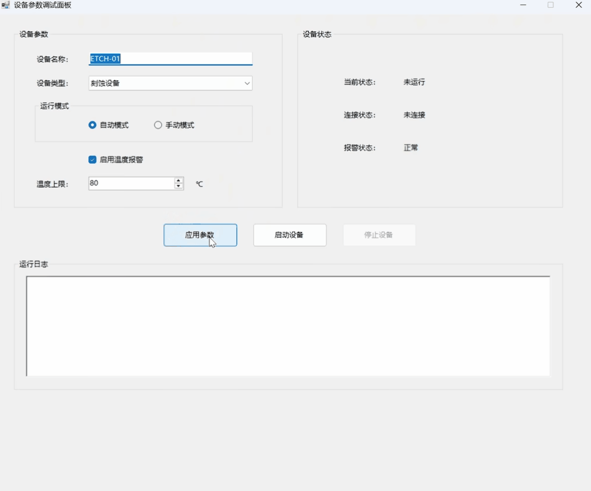
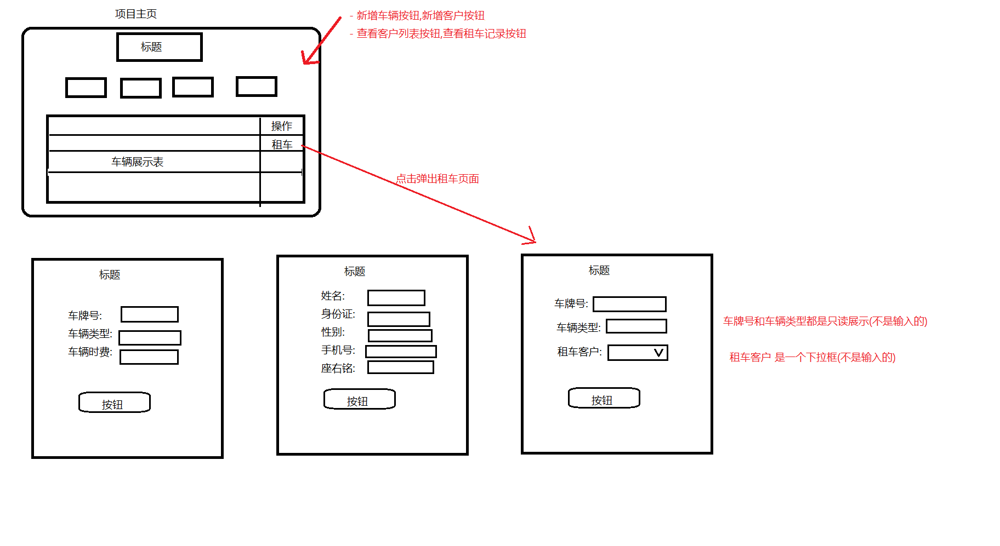

# 二阶段考试

## 一、选择题（每题2分，共20分）

1. 在 WinForm 中，用于显示文本且用户不能直接编辑的控件是（ ）
   A. TextBox B. Label C. Button D. ComboBox

2. 设置窗体标题应修改窗体的哪个属性（ ）
   A. Name B. Text C. Title D. Caption

3. 单击按钮时触发的事件是（ ）
   A. Click B. Load C. TextChanged D. SelectedIndexChanged

4. 在 WinForm 中弹出简单提示框应使用（ ）
   A. Console.WriteLine() B. MessageBox.Show()
   C. DialogResult.Show() D. Form.Show()

5. 在 WinForm 中，执行耗时操作时避免界面卡死，推荐使用（ ）
   A. Thread.Sleep B. async/await 与 Task.Run
   C. while 死循环 D. Application.Exit

6. 关于 async/await，下列说法正确的是（ ）
   A. async 方法必须返回 void
   B. await 只能用于 async 方法中
   C. await 会阻塞 UI 线程
   D. Task.Run 只能同步执行

7. 使用 MySqlConnector 连接 MySQL 时，需要引入的命名空间是（ ）
   A. System.Data.SqlClient B. MySqlConnector
   C. System.Data.MySql D. MySql.Data

8. 下列对象中，用于建立 MySQL 数据库连接的是（ ）
   A. MySqlCommand B. MySqlConnection
   C. MySqlDataReader D. MySqlDataAdapter

9. 在 SQL 中，查询数据使用的语句是（ ）
   A. SELECT B. UPDATE C. INSERT D. DELETE

10. 在 WinForm 中，跨线程更新 UI 控件，正确做法是（ ）
    A. 直接在新线程中修改控件属性
    B. 使用控件的 Invoke 或 BeginInvoke
    C. 使用 Console.WriteLine
    D. 使用 Thread.Sleep


## 二、填空题（每空2分，共10分）

1. WinForm 窗体类通常继承自 __类。
2. 按钮点击事件名称是 ________。
3. 在 async 方法中，等待异步操作完成使用 ______ 关键字。
4. 窗体加载时触发的事件是 ___。
5. TCP 服务端开始监听使用 TcpListener 的 ______ 方法。


## 三、多选题（每题2分，共10分）

1. 下列属于 WinForm 常用控件的有（  ） 
    A. Button 
    B. TextBox 
    C. DataGridView 
    D. Console

2. 关于 WinForm 控件与事件，下列说法正确的有（ ）
   A. Label 控件可用于显示提示文本
   B. TextBox 的 Text 属性可获取或设置文本
   C. Button 的 Click 事件在按钮被单击时触发
   D. Form 的 Load 事件在窗体关闭时触发

3. 关于 async/await 与 Task 说法正确的有（  ） 
    A. async 方法通常返回 Task 或 Task<T>
    B. await 用于等待异步操作完成
    C. async void 常用于事件处理方法 
    D. await 一定会阻塞当前线程

4. 关于跨线程更新 UI，下列说法正确的有（ ）
    A. 子线程直接修改控件属性可能引发异常
    B. 可以使用 Control.Invoke 同步调用 UI 线程
    C. 可以使用 Control.BeginInvoke 异步调用 UI 线程
    D. 所有控件都可以在任意线程中直接修改

5. 关于 TCP 通信，下列说法正确的有（ ）
   A. TcpListener 用于服务端监听客户端连接
   B. TcpClient 可用于客户端连接服务端
   C. NetworkStream 可用于读写数据
   D. TCP 是面向无连接的协议


## 四、编程题(60分)

### 设备参数调试面板编程题(20分)

> 根据一下的动图,实现动图中的静态窗体,及启动的执行操作效果





### 车辆租还系统编程题(40分)

> 根据一阶段学习的车辆租还系统项目,  实现一个winform的车辆租还系统项目

- 功能要求
  - 完成主页
    - 包含车辆信息表格展示(包含租车操作)
    - 新增车辆按钮,新增客户按钮
    - 查看客户列表按钮,查看租车记录按钮
  - 车辆添加
    - 车辆添加页面
    - 实现车辆添加功能
  - 客户添加
    - 客户添加页面
    - 实现客户添加功能
  - 租车
    - 租车页面
    - 实现租车功能

- 租车项目框架示意图



- 数据表

  ```sql
  CREATE TABLE `car` (
    `id` INT PRIMARY KEY AUTO_INCREMENT COMMENT '车辆主键ID',
    `card` VARCHAR(30) NOT NULL COMMENT '车牌号',
    `type` VARCHAR(50) NOT NULL COMMENT '车辆类型',
    `status` TINYINT NOT NULL DEFAULT 1 COMMENT '1空闲，0已出租',
    `price` DECIMAL(10,2) NOT NULL COMMENT '每小时租赁费用',
  ) ENGINE=InnoDB DEFAULT CHARSET=utf8mb4 COMMENT='车辆信息表';
  
  CREATE TABLE `user_info` (
    `id` INT PRIMARY KEY AUTO_INCREMENT COMMENT '客户主键ID',
    `name` VARCHAR(50) NOT NULL COMMENT '客户姓名',
    `id_card` VARCHAR(20) NOT NULL COMMENT '身份证号',
    `reg_time` DATETIME NOT NULL COMMENT '注册时间',
    `gender` VARCHAR(10) COMMENT '性别',
    `tel` VARCHAR(20) COMMENT '手机号码',
    `motto` VARCHAR(200) COMMENT '座右铭',  
  ) ENGINE=InnoDB DEFAULT CHARSET=utf8mb4 COMMENT='客户信息表';
  
  CREATE TABLE `rent_return` (
    `id` INT PRIMARY KEY AUTO_INCREMENT COMMENT '租赁记录ID',
    `car_id` INT NOT NULL COMMENT '车辆ID，外键指向car表',
    `user_id` INT NOT NULL COMMENT '客户ID，外键指向user_info',
    `rent_time` DATETIME NOT NULL COMMENT '租车时间',
    `return_time` DATETIME NULL COMMENT '还车时间，NULL代表尚未还车',
    `pay_money` DECIMAL(12,2) NOT NULL DEFAULT 0 COMMENT '应付租金',
  ) ENGINE=InnoDB DEFAULT CHARSET=utf8mb4 COMMENT='租还车记录';
  ```

  


# 提交方式

将答案按要求写入 比如： `XXX名字` 其中的文件规则如下

- 选择题填空题.txt
- 编程题文件夹
  - 设备参数调试面板源码文件夹
  - 车辆租还系统源码文件夹
  - 效果演示视频文件夹
    - 编程题1效果演示视频
    - 编程题2效果演示视频1