# day01

## 一、visionPro介绍

### 1、概念

概念：VisionPro 是美国康耐视 Cognex 推出的 PC 端工业机器视觉软件平台，运行在 Windows 工控机上，是一套拿来做工业图像处理的完整开发工具包。

它有两套开发模式：

1. `QuickBuild`：拖拽图形化开发，不用大量写代码，把视觉工具像搭积木一样串联，快速调试验证项目；
2. `.NET API（C#）二次开发`：把视觉能力嵌入自己写的 WinForm/WPF 上位机，做完整工业软件，对接 PLC、机器人、MES 数据库，工业项目最终基本都会用这套模式。
3. 配套可选模块：VisionPro DeepLearning 深度学习模块，传统算法搞不定的复杂缺陷，用 AI 来做检测分类，传统算法和 AI 可以混合在一起使用。

如果说相机是工业的眼睛，那visionpro就是工业的大脑，负责看懂图片、计算坐标、判断好坏、输出信号给产线设备。

康耐视 Cognex1981 年在美国成立，出身麻省理工，是全球最早一批做工业机器视觉的公司。1997 年推出PatMax 几何模板匹配算法，解决工件旋转、遮挡、光照变化下稳定定位的难题，成为行业标杆算法。后续为了 在电脑上开发复杂视觉项目，推出 VisionPro 软件，把 PatMax、卡尺、Blob、读码等大量成熟工业算子封装成工具。早期只有传统规则视觉；2019 之后加入 ViDi 深度学习套件，后续迭代为 VisionPro DeepLearning，实现传统视觉 + AI 融合；不断迭代版本，现在主流是 9.x、10.x 版本。

很早以前，我们做工业的视觉项目，需要自己写底层图像算法，对图像进行标注、测量、识别，难度非常大，VisionPro 把大量经过千万产线验证的成熟算法封装好，工程师直接调用工具，不用从零写底层。

### 2、为什么要学习他

半导体、3C 电子、汽车零部件、锂电行业大量岗位要求会 VisionPro；很多视觉集成公司、设备厂商，项目直接用它开发。学会它，直接匹配工业视觉工程师、上位机视觉开发岗位。	

visionpro定义了工业项目的完整流程：图像采集→定位→测量 / 检测→逻辑判断→对外通信。既可以拖拽快速验证效果，又可以 C# 二次开发，刚好对接上位机开发，学完既能调视觉算法，又能写软件界面，复合能力很吃香。吃透 VisionPro，再去学 Halcon、海康 VisionMaster，上手会非常快。

### 3、visionPro的作用

- 定位引导：

  工件随便摆放、倾斜、部分遮挡，输出 XY 坐标、旋转角度，发给机器人 / 机械手完成抓取、点胶、组装。半导体芯片、3C 零件大量使用。

- 精准测量：

  卡尺、圆拟合工具做亚像素测量，测孔径、间隙、宽度、角度，对比公差，替代人工千分尺卡尺。

- 外观缺陷检测：

  检测划痕、脏污、气泡、溢胶、缺料、焊点不良，输出 OK/NG，触发流水线剔除不良品；简单缺陷传统工具，复杂多变缺陷交给深度学习 AI。

- 条码字符识别追溯：

  读取一维码、二维码、校验印刷字符，对接 MES 系统，实现产品全流程追溯。

### 4、visionpro的地位

1. 工业视觉的标杆级商业软件，全球大量高端制造产线上稳定运行，可靠性经过几十年千万级产品验证。
2. .NET 生态最佳的商业视觉平台，和 C#/WinForm/WPF 兼容性极好，做上位机视觉项目优先选型。
3. 定位测量类项目公认强项，PatMax 模板匹配是行业教科书级算法。
4. 多用于高要求行业：汽车零部件、半导体、医疗器件、3C 消费电子、锂电，项目预算充足、对稳定性要求高的项目首选。
5. 行业地位总结：不是唯一，但属于工业视觉工程师必须了解学习的主流平台。

### 5、对比其他软件

| 软件             | 厂商               | 核心优势                                                     | 主要缺点                                                     | 适合场景                                                  |
| ---------------- | ------------------ | ------------------------------------------------------------ | ------------------------------------------------------------ | --------------------------------------------------------- |
| **VisionPro**    | 美国康耐视 Cognex  | PatMax 定位极强；.NET (C#) 友好；Fixture 动态坐标系；产线稳定性强；拖拽 + 代码双模式；传统 + AI 混合开发；全球案例多； | 正版授权费用高；资料中文偏少；硬件加密狗，分发部署成本高；   | 汽车、半导体、医疗；C# 上位机一体化项目；高稳定性要求项目 |
| **Halcon**       | 德国 MVTec         | 算子数量极多，自由度上限高；3D 视觉强大；授权按开发版，运行版成本相对低；支持 C#/C++ | 语法自成一套 HDevelop 语言；和 C# 集成需要二次封装；定位工具综合稳定性略弱 PatMax； | 算法深度开发、复杂测量、3D 项目；追求技术上限             |
| **VisionMaster** | 海康机器人（国产） | 全中文界面；拖拽开发上手快；价格友好；国产硬件生态打通；文档中文完善； | 复杂缺陷深度学习能力弱于海外商业软件；大型复杂项目灵活性受限； | 国内中小型 2D 项目；快速交付，预算有限；国产设备项目      |
| **OpenCV**       | 开源免费           | 完全免费，跨平台；底层算法全部可见；学习计算机视觉原理首选   | **不是工业软件库，没有工业封装**；没有 PatMax 这种工业级匹配；没有现成 IO、PLC 通信；工程化全部自己写，工厂落地风险高； | 算法学习、科研、原型验证，不直接用于工业产线交付          |

总结：

- 想学底层算法原理：OpenCV
- 追求算法上限，做复杂 3D / 测量：Halcon
- C# 上位机、追求产线稳定，高端制造：VisionPro
- 国内项目、预算有限，快速落地：海康 VisionMaster

AI是附加模块，需要单独付费，正常付费软件安装后，还需要单独给ai付费，但不是所有工作都需要ai。

- 特征固定：比如找圆孔、找边角、固定模板工件定位，用 PatMax、卡尺、Blob，速度快，可控，优先用传统算法。
- 工件形变大、纹理变化大，传统 PatMax 匹配不好用的时候，AI 找工件位置；缺陷形态五花八门，划痕、污渍、瑕疵没有固定形状，写不出固定参数规则，人工标注样本训练 AI，自动分割缺陷区域。比如塑胶件表面各种随机划痕脏污。

## 二、软件安装

**<font color="red">安装前先关闭电脑的杀毒软件。</font>** 

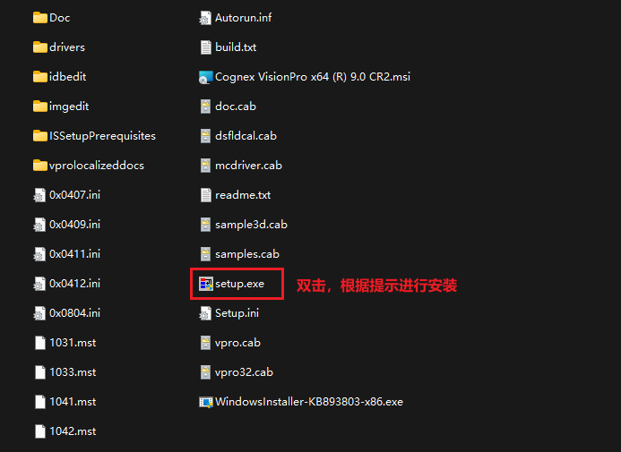 

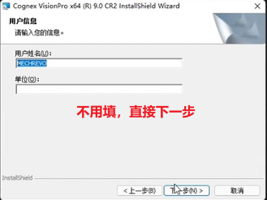 

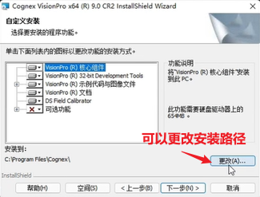 

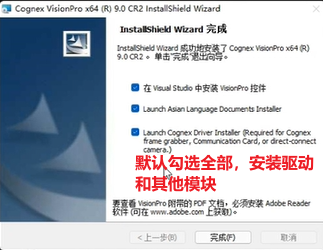 

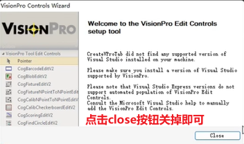 

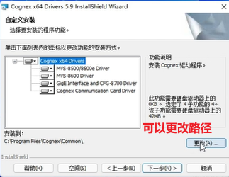 

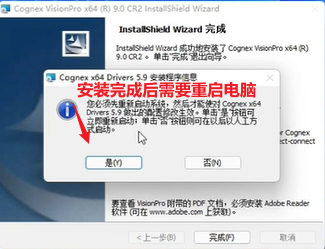 

**<font color="red">重启电脑后，关闭所有杀毒软件。</font>** 

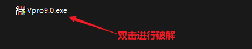 

安装好打开后，大部分电脑都会碰到界面显示奇怪的问题：

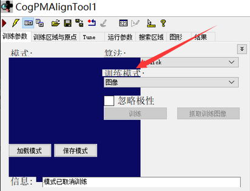 

这是由于系统分辨率和软件分辨率不匹配造成的。解决方案：

- 鼠标右击软件图标，选择属性

  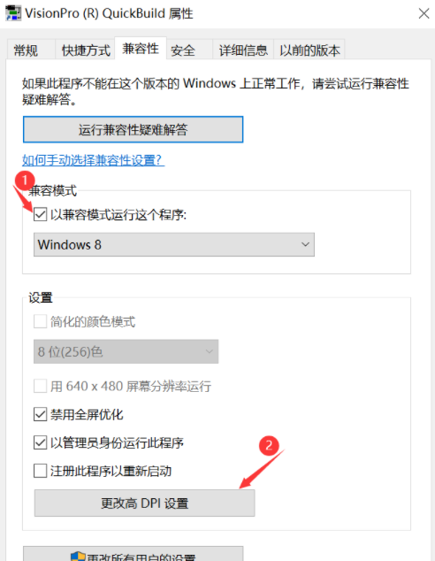 

- 修改分辨率设置

  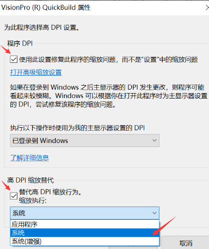 

## 三、软件使用介绍

操作界面：

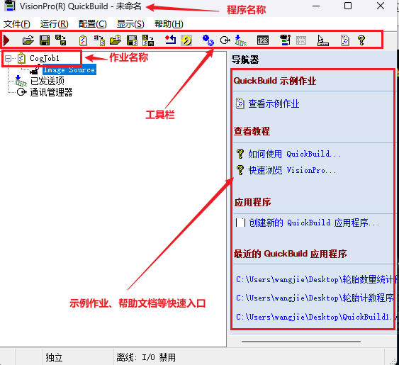 

程序架构：

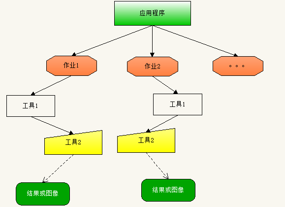 

应用程序中可以包含多个作业，1个作业中包含多个工具，每个工具都是某种功能用于处理图像，最终经过多个工具处理得出结果。

程序、作业、工具都可以单独保存成vpp文件，可以用winform程序加载使用。

Image Source用于采集图像，图像可以是相机采集的，也可以使用本地文件夹中的。

工具栏：

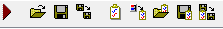 

单次运行程序、打开程序、保存程序、另存为、新建job、导入工具组、打开job、保存job、另存为job。

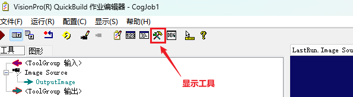 

## 四、工具分类

### 1、无类别

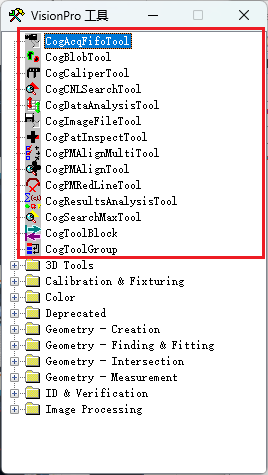 

这类别的工具是没有专门做分类的，使用比较频繁，没有特定功能类别，主要用于做模板匹配、斑点分析。

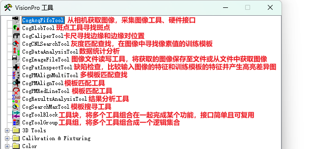 

### 2、其他工具

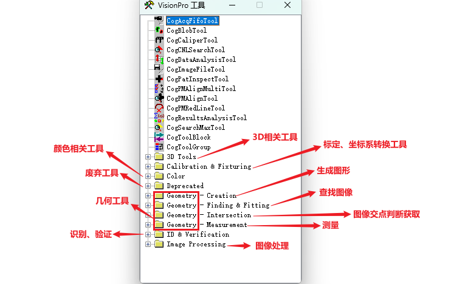 

3D相关类别，用来处理、分析和测量三维数据。

标定、坐标系转换：实现图像矫正、不同坐标系之间的转换

颜色相关的工具：用于分析图像的颜色特征，适用于质量控制和缺陷检测

几何工具：可以对图像中的特定几何形状进行尺寸、角度和位置的精准测量

识别、验证工具：做条形码、文字识别

图像处理：包括图像增强、边缘检测、阈值处理等，帮助用户对输入图像进行改进和分析

### 3、标定、坐标系转换工具

| 工具名称                     | 功能                                   |
| ---------------------------- | -------------------------------------- |
| CogCalibCheckerboardTool     | 标定板校正工具，使返回的值更具实际意义 |
| CogCalibImageCorrectorTool   | 校正工具（用于校正图像的失真）         |
| CogCalibNPointToNPointTool   | 标定工具                               |
| CogFixtureNPointToNPointTool | 将程序坐标控件定位至图像内容空间       |
| CogFixtureTool               | 定位工具                               |

### 4、颜色工具

| 工具名称               | 功能                                         |
| ---------------------- | -------------------------------------------- |
| CogColorExtractorTool  | 颜色提取：从彩色图像中抽取像素来创建灰度图像 |
| CogColorMatchTool      | 颜色匹配：检查某块区域的色彩                 |
| CogColorSegmenterTool  | 颜色分割：从彩色图像中分离指定颜色像素       |
| CogCompositeColorMatch | 复合颜色匹配：从彩色图像中检查颜色容量       |

### 5、几何工具创建

| 工具名称                       | 功能                         |
| ------------------------------ | ---------------------------- |
| CogCreateCircleTool            | 创建圆                       |
| CogCreateEllipseTool           | 创建椭圆                     |
| CogCreateGraphicLabel          | 创建图像标签                 |
| CogCreateLineBisectPointsTool  | 创建两点的平分线             |
| CogCreateLineParallelTool      | 在某一点创建某条线的平行线   |
| CogCreateLinePerpendicularTool | 在某一点创建某条线的垂直线   |
| CogCreateLineTool              | 根据指定点和角度创建一条直线 |
| CogCreateSegmentAvgSegsTool    | 创建两条线段的平均线         |
| CogCreateSegmentTool           | 创建线段                     |

### 6、几何查找、拟合

| 工具名称                   | 功能         |
| -------------------------- | ------------ |
| CogFindCircleTool          | 找圆工具     |
| CogFindCornerTool          | 找角工具     |
| CogFindEllipseTool         | 找椭圆工具   |
| CogFindLineTool            | 找线工具     |
| CogFitCircleTool           | 拟合圆       |
| CogFitEllipseTool          | 拟合椭圆     |
| CogFitLineTool             | 拟合直线     |
| CogMultiFindLineFinderTool | 查找多条直线 |

### 7、几何相交工具

| 工具名称                       | 功能                   |
| ------------------------------ | ---------------------- |
| CogIntersectCircleCircleTool   | 检测两圆是否相交       |
| CogIntersectLineCircleTool     | 检测线与圆是否相交     |
| CogIntersectLineEllipseTool    | 检测线与椭圆是否相交   |
| CogIntersectLineLineTool       | 检测线和线是否相交     |
| CogIntersectSegmentCircleTool  | 检测线段与圆是否相交   |
| CogIntersectSegmentEllipseTool | 检测线段与椭圆是否相交 |
| CogIntersectSegmentLineTool    | 检测线段与直线是否相交 |
| CogIntersectSegmentSegmentTool | 检测线段与线段是否相交 |

### 8、几何测量工具

| 工具名称                      | 功能                       |
| ----------------------------- | -------------------------- |
| CogAngleLineLineTool          | 两条直线的夹角             |
| CogAnglePointPointTool        | 由两点组成的有向线段的角度 |
| CogDistanceCircleCircleTool   | 两圆的最短距离             |
| CogDistanceLineCircleTool     | 线到圆的最短距离           |
| CogDistanceLineEllipseTool    | 线到椭圆的最短距离         |
| CogDistancePointCircleTool    | 点到圆的最短距离           |
| CogDistancePointEllipseTool   | 点到椭圆的最短距离         |
| CogDistancePointLineTool      | 点到直线的最短距离         |
| CogDistancePointPointTool     | 点到点的距离               |
| CogDistancePointSegmentTool   | 点到线段的最短距离         |
| CogDistanceSegmentCircleTool  | 线段到圆的最短距离         |
| CogDistanceSegmentEllipseTool | 线段到椭圆的最短距离       |
| CogDistanceSegmentLineTool    | 线段到线的最短距离         |
| CogDistanceSegmenSegmenTool   | 线段到线段的最短距离       |

### 9、识别验证工具

| 工具名称      | 功能                                           |
| ------------- | ---------------------------------------------- |
| CogIdTool     | 条形码识别                                     |
| CogOCRMaxTool | 字符识别                                       |
| CogOCVMaxTool | 光学字符验证工具，可以对一个或多个字符进行验证 |

### 10、图像处理工具

| 工具名称                            | 通知                                     |
| ----------------------------------- | ---------------------------------------- |
| CogAffineTransformTool              | 通过仿射变换产生新的图像                 |
| CogCopyRegionTool                   | 复制输入图像的一部分到输出图像           |
| CogHistogramTool                    | 对图像中的像素值进行统计测量             |
| CogImageAverageTool                 | 基类同一场景的不同图像并产生一个平均图像 |
| CogImageConvertTool                 | 将图像从一种格式转换为另一种格式         |
| CogImageSharpnessTool               | 用来判断图像的锐利度                     |
| CogIPOneImageTool                   | 执行基本图像处理操作                     |
| CogIPTwoImageAddTool                | 由两个输入图像产生一个输出图像           |
| CogIPTwoImageMinMaxTool             | 结合两个图像的像素最小值或最大值         |
| CogIPTwoImageSubtractTool           | 两幅图像相减得到输出图像                 |
| CogLinescanDistortionCorrectionTool | 从线扫相机获得图像                       |
| CogPixelMapTool                     | 定义输入图像与输出图像之间的映射         |
| CogPolarUnwrapTool                  | 将输出图像部分转换为输出图像             |
| CogSobelEdgeTool                    | 边缘提取工具：用于分离或增强边界信息     |

## 五、PMA简单使用

> CogPMAignTool是一个模型定位工具，其首先训练一个模型，然后在运行时图像上查询一个或多个已训练的模型。

算法：visionPro使用的算法是一种图案位置搜索技术，基于边缘特征，不依赖于像素格。特征是图像中不同区域边界的轮廓线，基于特征的表现可以比基于像素格的表现更快捷和准确。

- PatMax：精确度高，在二维元件上表现最好，适合一些细微的特征。
- PatQuick：速度快，使用三维或者低质量原件效果好。
- PatFlex：在弯曲不平的表面原件上最好，灵活但不够精确。
- PatMax高灵敏度：适用于对比度很低或者噪音或图像变形严重时。
  - 透视：适用于透视失真的二维特性。

模型区域：模型区域就是你用来作为模型特征的区域
模型原点：模型原点就是您想要在模型中得到的点，一般选择中心原点。
极性：极性表示特征边界点是从黑到白还是从白到黑，忽略极性可以增加模型的多样性。

PMA使用方式：

- 抓取训练图像
- 设置区域和中心点
- 设置训练参数
- 训练图像

输入图像：

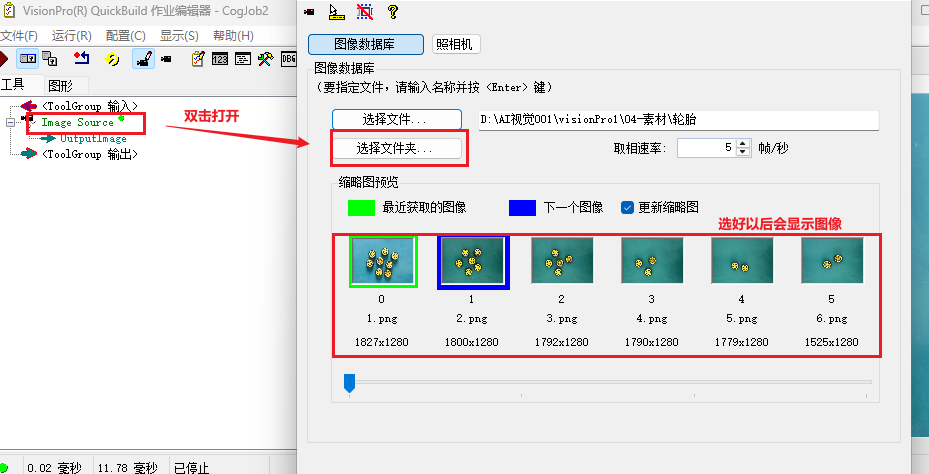 

选好图像就可以关闭这个弹窗了，然后在主页面一定要先点击运行，才能在右侧预览窗口看到图像：

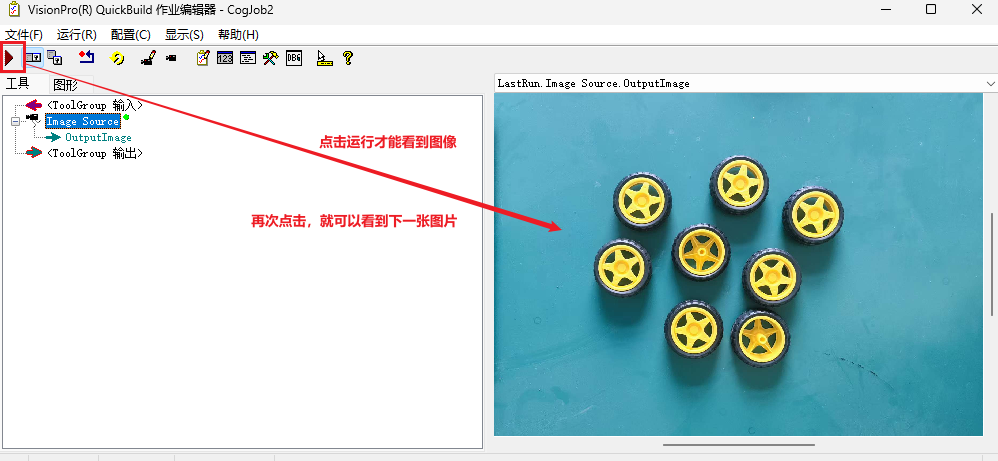 

选择工具：

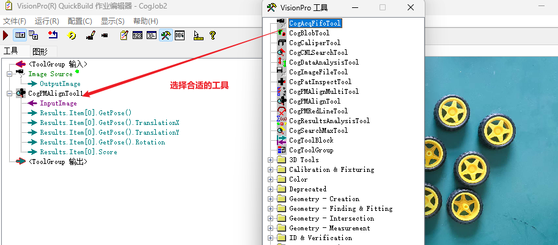 

图像传递：

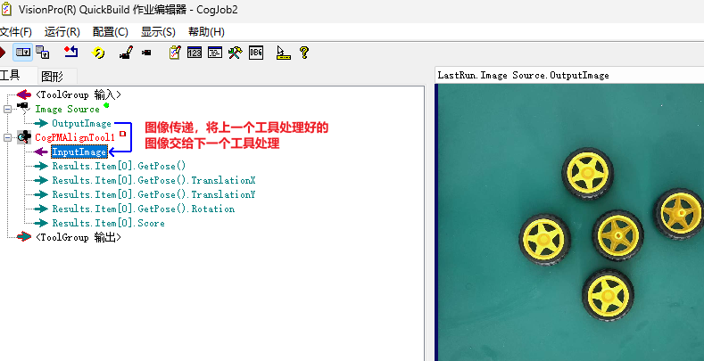 

可以按下鼠标拖拽实现。然后运行图像：

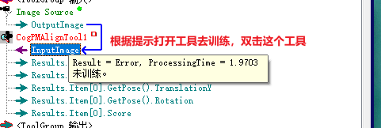 

区域形状：

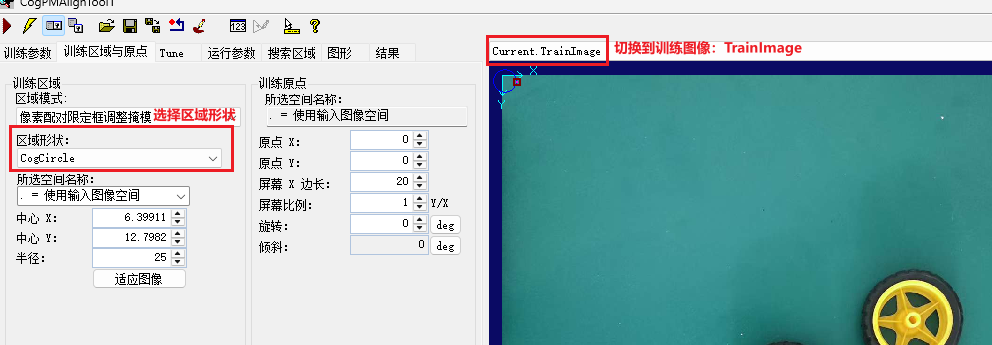

回到训练参数页面，抓取训练图像，才能在右侧图像上显示设置的形状：

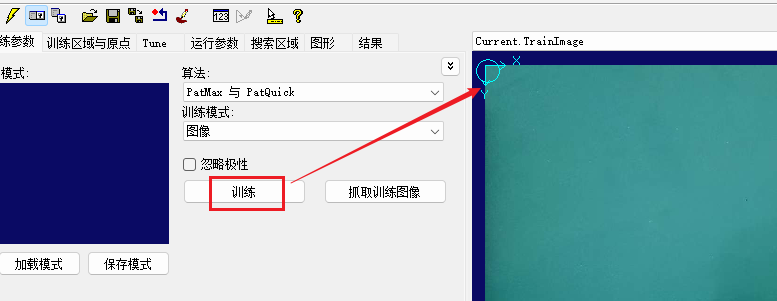 

调整形状区域：

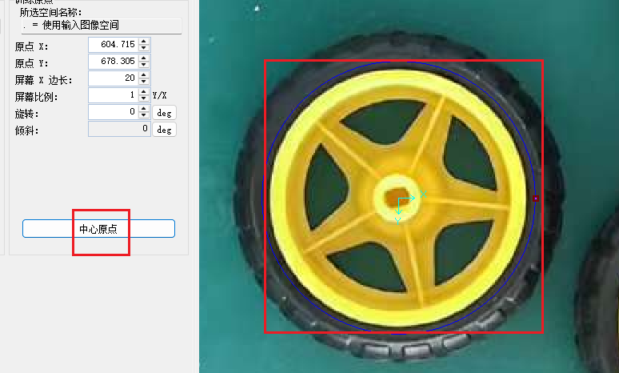 

设置参数：

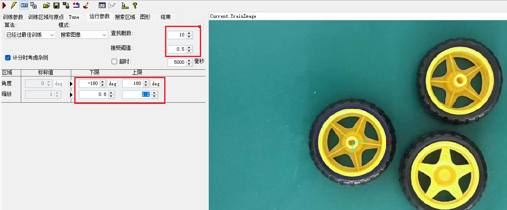 

查找概数：设置为希望在图像中找到的最大结果数量

接受阈值：结果得分大于等于这个数值（可以理解为相似度）

旋转角度：平面旋转后也要能识别到

缩放：放大缩小也能识别到

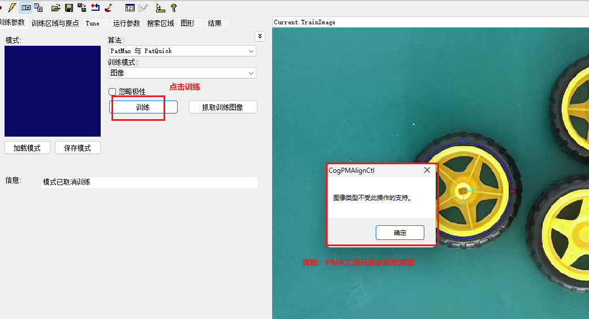 

<font color="red">**PMA识别的是灰度图（黑白图，不要彩色），所以一般在PMA工具之前，我们都应该先用灰度图工具处理后，再将图像传递给PMA训练。**</font> 

灰度图工具：

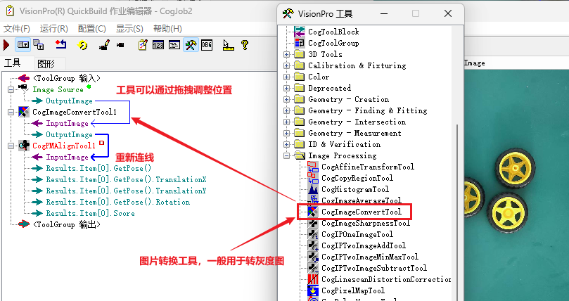 

结果说明：

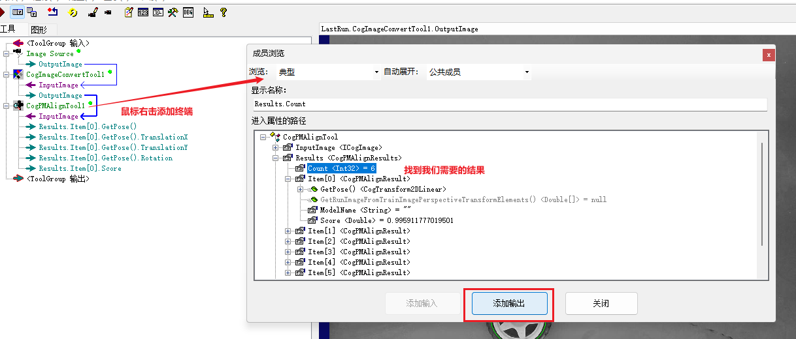 


## 六、winform中集成visionPro

### 1、导出vpp

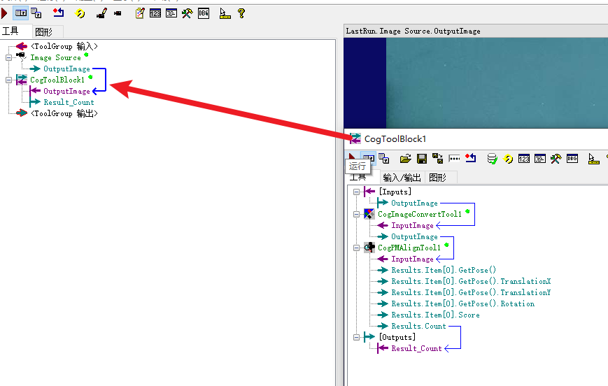

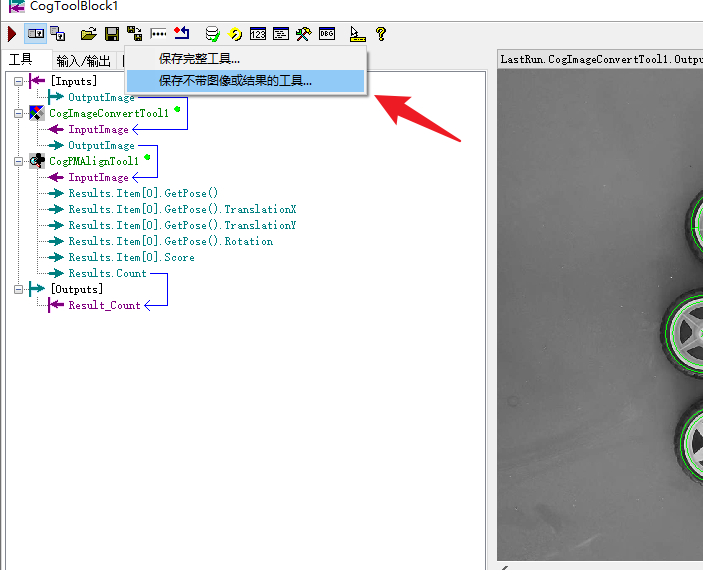 

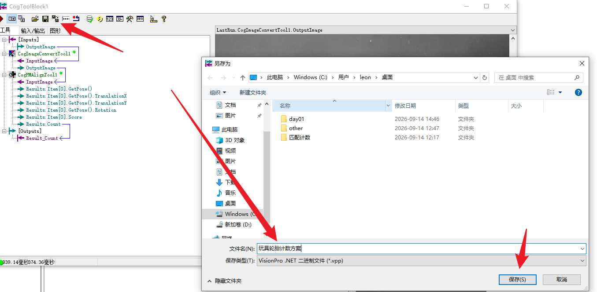

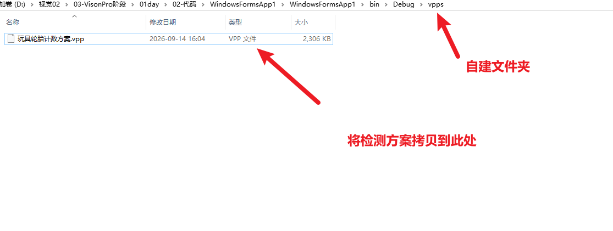

### 2、项目导入visionpro库

要在winform中使用visionPro里面的功能，也需要导入在winform中支持visionPro操作的库。

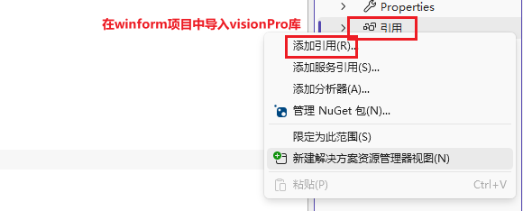 

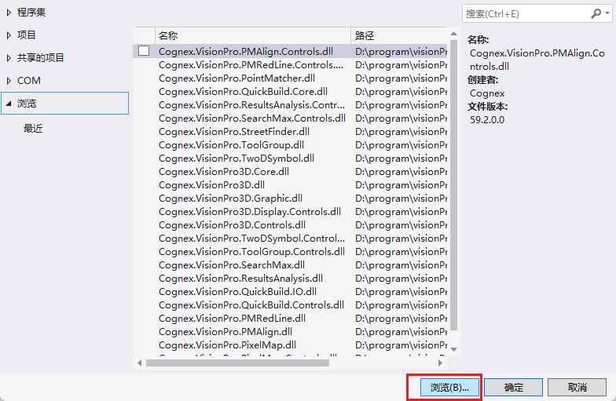 

找到visionPro安装目录中的D:\program\visionPro\VisionPro\ReferencedAssemblies文件夹，将所有的dll库文件都选中，点击确定引入。

### 3、集成

将导出的方案放入项目目录中：


代码集成：

```c#
// 选择图片
using (OpenFileDialog OFD = new OpenFileDialog())
{
    // 配置
    OFD.Filter = "图片格式|*.jpg;*.jpeg;*.png;*.gif;";
    OFD.Title = "选择轮胎图片";
    // 打开
    if (OFD.ShowDialog() == DialogResult.OK)
    {
        // 选好了
        //MessageBox.Show(OFD.FileName);
        pictureBox1.Image = Image.FromFile(OFD.FileName);
        pictureBox1.SizeMode = PictureBoxSizeMode.StretchImage;
        // 使用visionPro库处理图片
        // 1、将文件用visionPro库处理后，才能得到一张能被visionPro方案处理的图片
        CogImageFileTool CIFT = new CogImageFileTool();
        CIFT.Operator.Open(OFD.FileName, CogImageFileModeConstants.Read);
        CIFT.Run();
        // 此时就可以从CIFT中获取到能被visionPro方案处理的图片了 CIFT.OutputImage 

        // 2、加载导出的vpp方案文件
        // 绝对路径拼接
        string VppFilePath = Path.Combine(Directory.GetCurrentDirectory(), "vpps", "玩具轮胎数量方案.vpp");
        object CSL = CogSerializer.LoadObjectFromFile(VppFilePath);
        //MessageBox.Show(VppFilePath);
        CogToolBlock DTB = (CogToolBlock)CSL;
        // 将上面处理过的图片给到vpp方案
        DTB.Inputs["OutputImage"].Value = CIFT.OutputImage;
        DTB.Run();
        label2.Text = DTB.Outputs["Result_Count"].Value.ToString();
    }
}
```

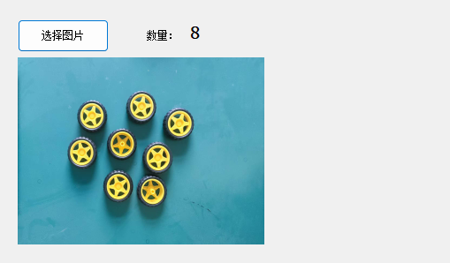 

## 七、掩膜器

标注5角的时候，图形没问题，但是其中的条纹会影响我们最终的结果。

如果能有一种工具，让我们标注了图形后，忽略其中的条纹，就可以将所有的5角都能选中了。

在PMA工具中，有一个工具叫掩膜器，用于忽略某些区域的工具。

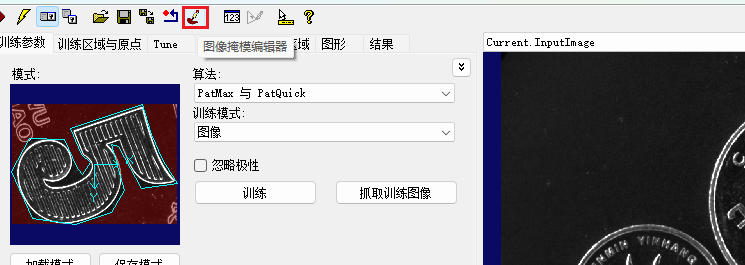 

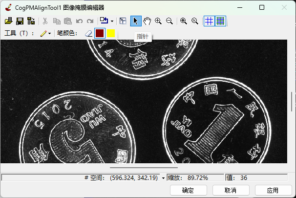 

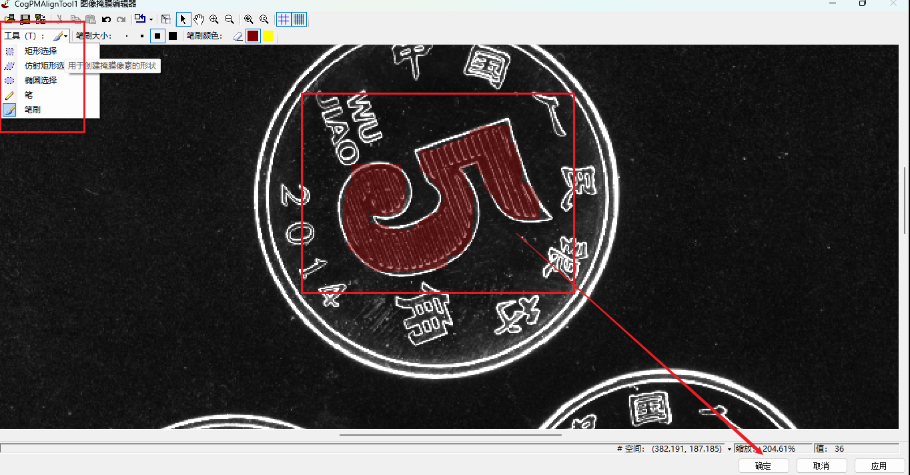 

确定后，我们重新训练，这时候，图形中被掩膜器覆盖的部分，就不再进行识别了，最终结果，识别的数量会多一些。

## 八、建模器

当我们需要标注不规则图形时，非常繁杂，不准确，这时候如果有一种工具能帮我们自动选中一些不规则图形的话，就会方便很多 ==> PMA中有一个建模器，可以让visionPro自动标注一些不规则的图形。

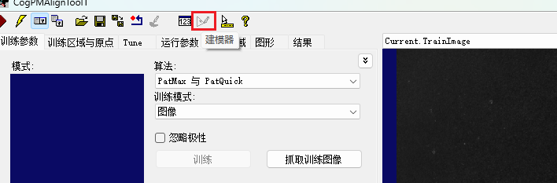 

默认他是禁用的。我们需要调整训练模式：带图像的形状模型，然后提取训练图像，工具图标就可以点击了。

点击打开后，我们可以选择提取形状，自动会帮我们把图片中所有的不规则形状标上，我们将不需要的删除，需要的保留，然后训练就好了。

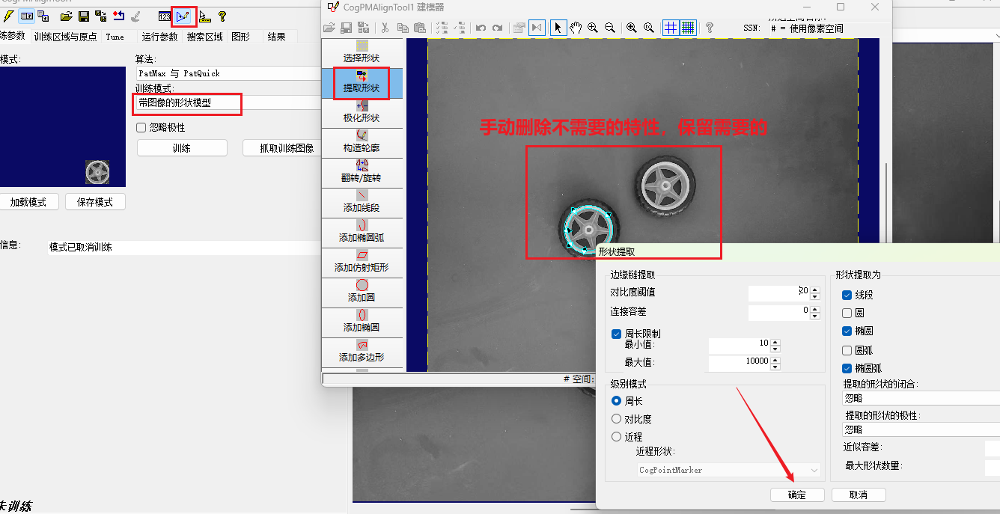 

使用PMA最重要的是挑选特性。


## 九、斑点工具

> ​     利用CogBlobTool工具，可以检测和定位图像中某一灰度范围内的形状未知的特征，这个过程叫做Blob分析。通过Blob分析，我们得到图像某一特征是否存在、数量、位置、形状、方向等信息。也可以利用Blob分析来发现图像中不同特征之间的关联关系。

Blob分析一般用在下列场合:

- 二维物体图像
- 高对比度图像
- 存在缺失检测
- 有尺寸和旋转不变性要求。


Blob分析的一般步骤是:`图像分割(分段)一>应用联通性规则一>执行形态学操作一>计算测量一>得出结果、输出图像`

图像分割的目的是确定哪些是斑点像素，哪些是背景像素。

图像分割模式可分以下四种:

硬阈值(固定阈值):   硬阈值是定义一个像素值为图像分割点，大于此像素值的为物体像素，小于此像素值的为背景像素，但是由于物体和背景交界处的像素值很难准确判断是目标像素或背景像素，这样在分割的时候容易产生空间量化错误。

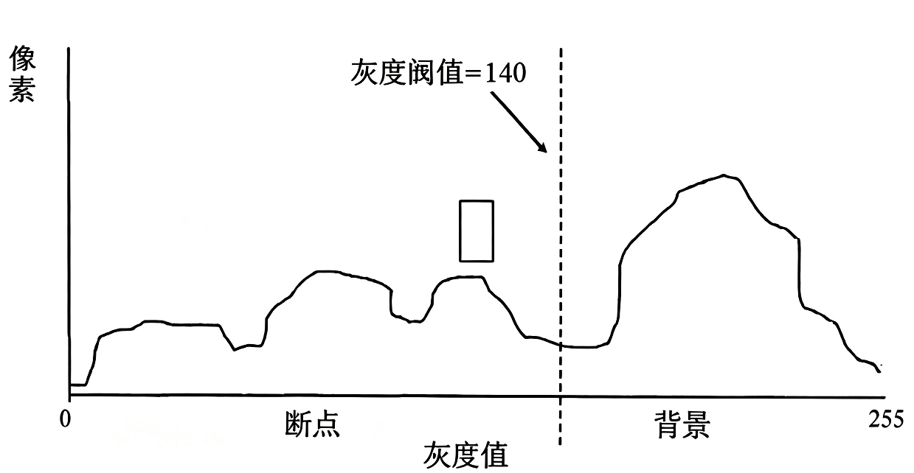

硬阈值(相对阈值): 是以灰度直方图中某个百分比处的像素值作为图像分割的阈值，其有两个重要的参数，第一个是尾值，包括左尾和右尾，第二个是阈值百分比。

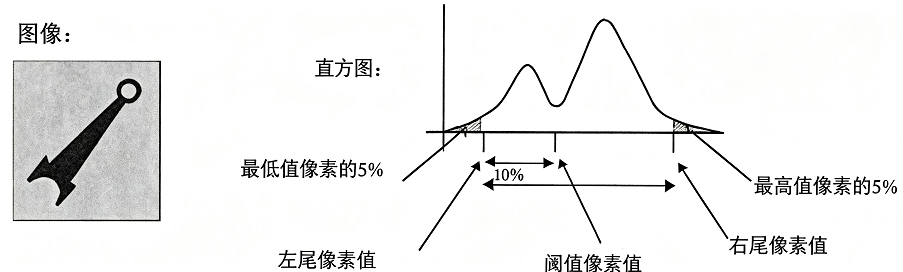


相对阈值一般使用在灯光 亮度变化的场合

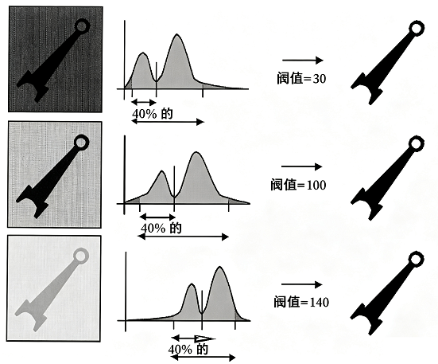

硬阈值(动态阈值):硬阈值动态阈值是根据输入图像直方图自动计算一个合适的分割阈值,其原理是尽可能最小化阈值两端的加权差.

软阈值(固定阈值):
和硬阈值不同的是，软阈值的图像分割点是一个像素区间，大于此区间内像素最大值的为物体像素，小于此区间内像素最小值的为背景像素，像素值在区间内的是边界像素

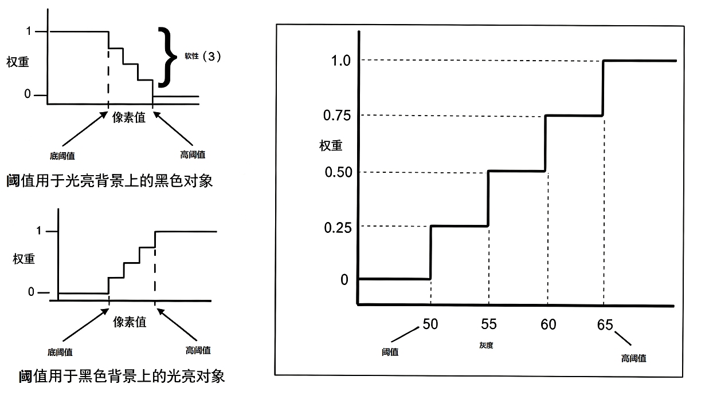

软阈值(相对阈值):  是在软阈值的基础上加上相对阈值的思想,具有低阈值、高阈值、低尾部、高尾部，柔和度几个参数。其计算高低阈值的过程和硬阈值(相对阈值)相同。低尾、高尾的像素值均被忽略,低百分比和高百分比之间的像素作为分隔阈值

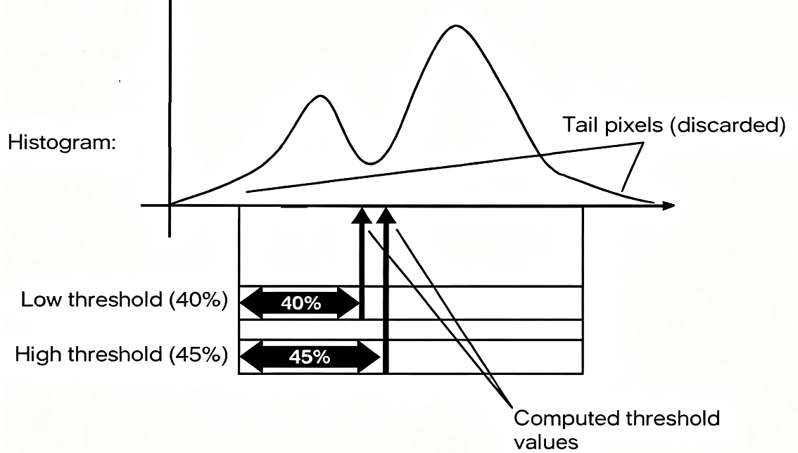


使用案例

可以用于处理同类型的圆孔图片。

例如：标注一张图片上每个骰子的点数。

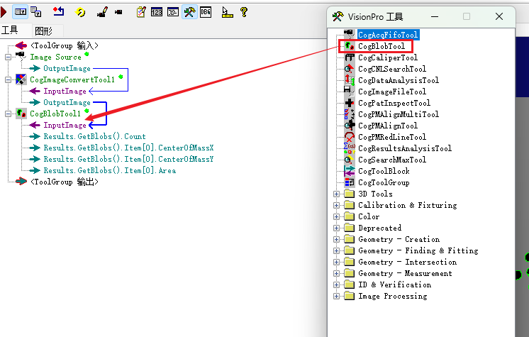 

设置参数：

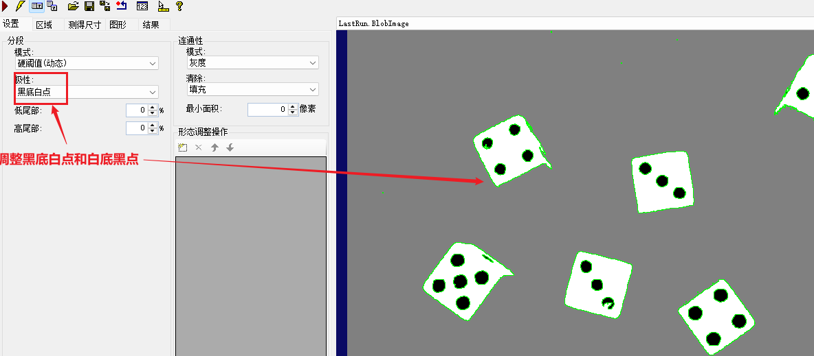 

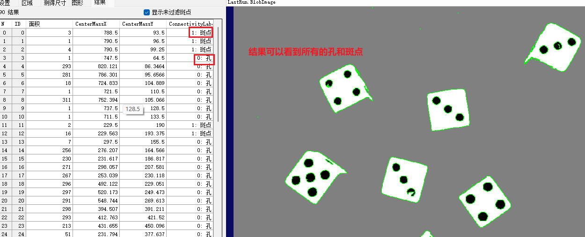 

通过设置过滤，将需要的保留，不需要的过滤：

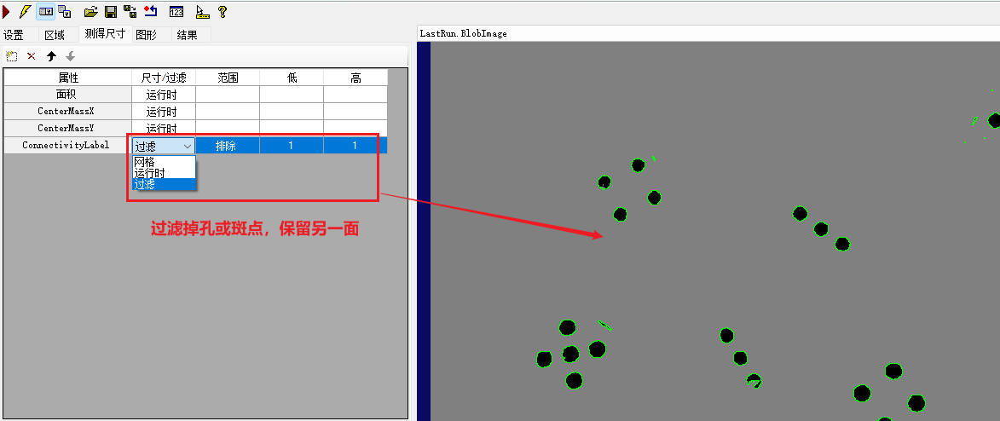 

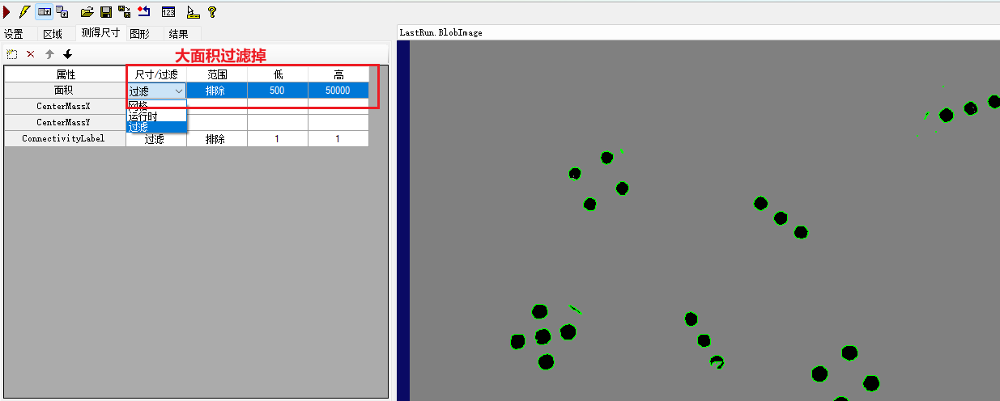 

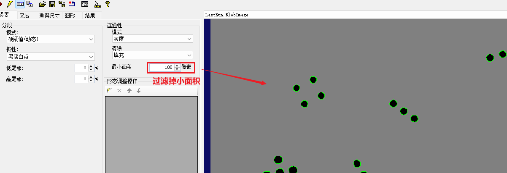 

直接就有结果了。

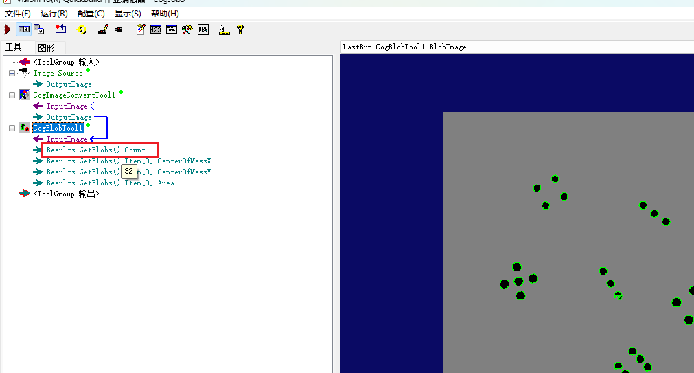 

有些零件如果有孔和斑点，可以利用斑点工具实现瑕疵检测，例如羊角零件。

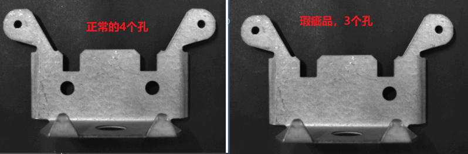 

有些时候，一个斑点工具无法实现复杂的面积过滤，就可以在第一个斑点工具后，再次使用斑点工具，进行再次过滤，实现效果：将200-400之间的面积的点数过滤掉

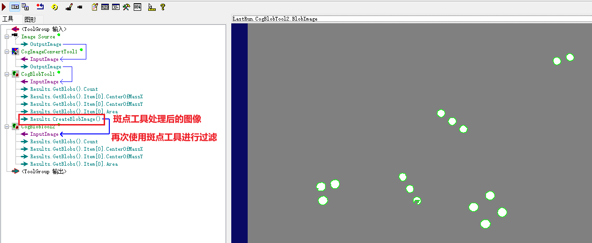 

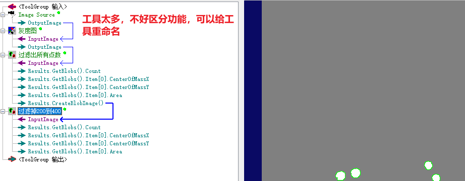 

作业：

1. 计算所有正面硬币的数量，在CogToolBlock中查看每种硬币的数量
2. 计算所有骰子总数，在winform代码中输出
3. 计算卡簧个数