# day02

## 一、上节回顾

#### PMA: CogPMAlignTool

- 模版匹配工具:  先训练模型, 通过训练的模型查找匹配的图像

  - 接受灰度图: CogImageConvertTool(灰度图转换工具)
  - 抓取训练图像(并切换到训练图像)
  - 设置模型区域(中心原点)
  - 设置运行参数(查找概数,接受阈值,角度,缩放)

  - 训练

- 掩膜器:  将模板中的不想要成为特征的部分掩盖

- 建模器: 模板匹配的 训练模式 设置为 `带图像的训练模型` 才要建模器

#### 斑点工具:  CogBlobTool

- 分析(灰度图)图像得到结果:  判断特征是否存在, 数量,大小....
  - 输出结果中也有处理好的灰度图(斑点灰度图) 可以进行二次处理

## 二、卡尺工具

卡尺工具主要用于寻找图像中的边缘或边缘对。在实际应用中，用于检测物体的长度、宽度等尺寸信息，它能够准确识别出图像中的边缘，并输出边缘的中心点在图像坐标中的位置，从而帮助我们获取物体的尺寸信息。卡尺工具在使用时，需要知道待测量边缘的大致位置和特征。

卡尺测量的**边缘**是图像中亮度、颜色或纹理等特征发生急剧变化的地方，这些变化通常代表了图像中不同对象的边界，可以用于图像分割、图像识别、图像压缩。

边缘对宽度：是对测量宽度的大概描述

对比度阈值：代表明与暗之间的变换程度，数值越大，对明暗要求越高（可以理解为颜色变化的程度），如果想找到特别明显的色差边缘，就将对比度阈值调整的大一点

过滤一半像素：是指边缘从暗到明或从明到暗的变换过程中占用了多少像素

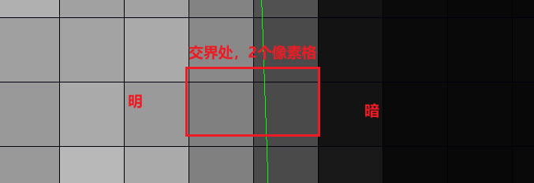 

最大结果数：从所有结果中保留的数量

浮动显示：可以根据空间坐标计算大概的宽度

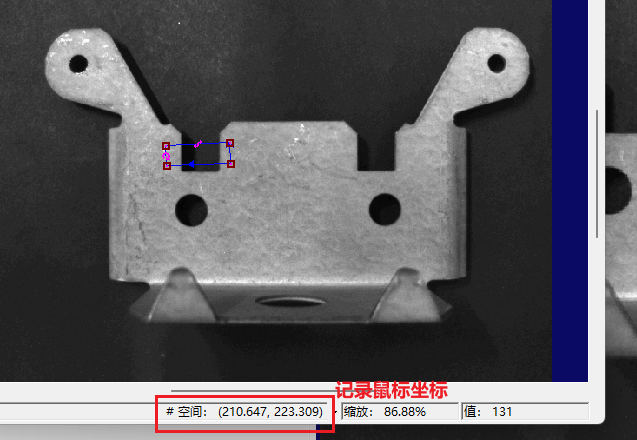 

## 三、查找、拟合几何图形

注意：从明到暗会好找一点 

比较常用的是找线和找圆。例如查找轴承圆的中心点。

### 1、找线工具

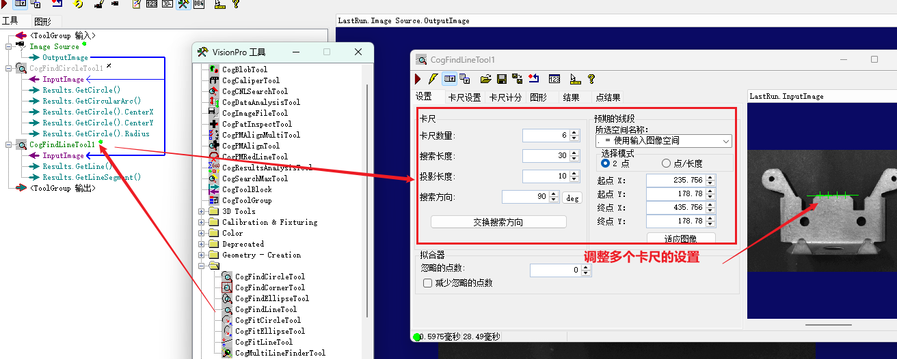 

### 2、找圆工具

找圆其实就是使用多个卡尺，卡一个圆出来。

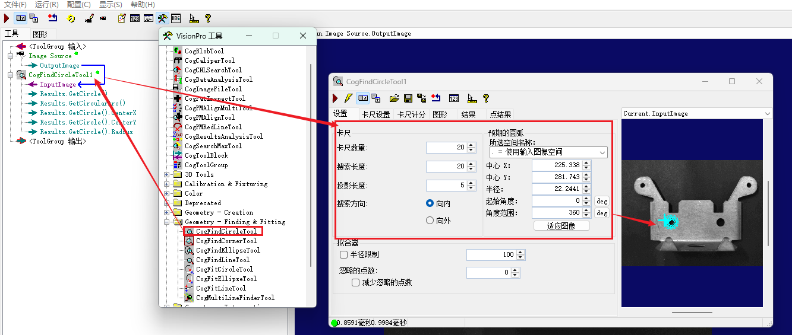 

### 3、其他工具

- 找椭圆

  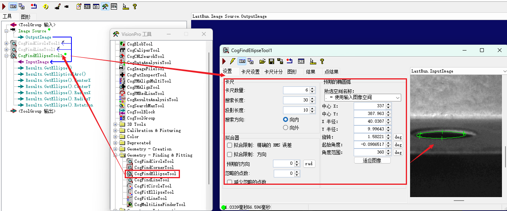 

- 找角

  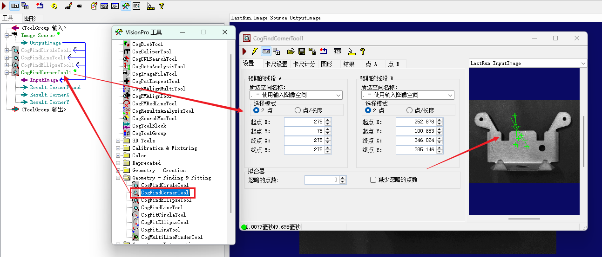 

- 拟合圆

  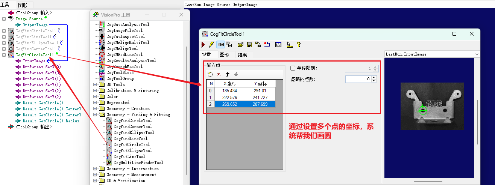 

- 拟合椭圆

  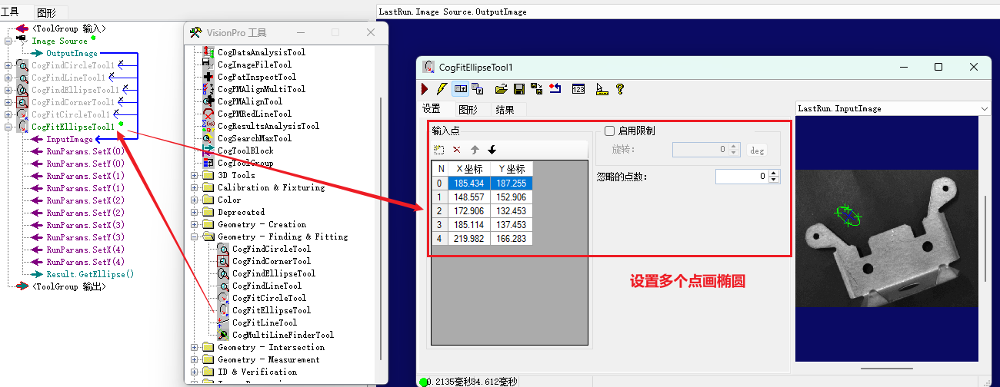 

- 拟合线

  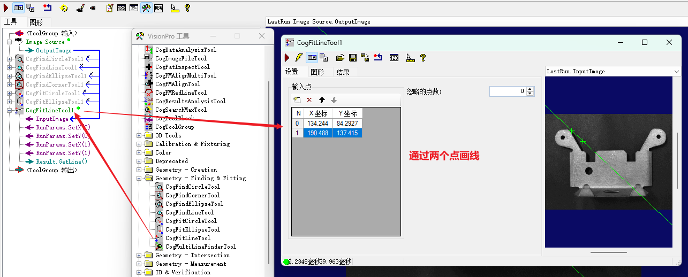 

- 多线查找

  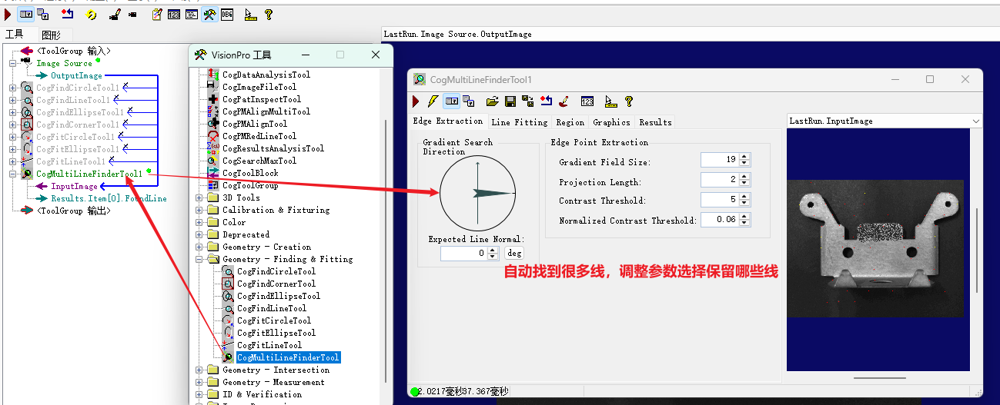 

## 四、定位工具

在羊角零件上找圆，当零件姿势发生变化时，就找不到了，因为我们标注的位置在空间坐标中没有变化，但零件圆的坐标发生了变化。

我们需要通过一个能创建空间坐标系的工具，创建一个坐标系，让这个坐标系根据零件的姿势变化发生变化，我们找圆的时候，可以不根据空间坐标系查找，而根据新创建的坐标系进行查找。

可以产生新坐标系的工具：CogFixtureTool、CogFixtureNPointToNPointTool、CogCalibNPointToNPointTool、CogCheckerboardCalibrationTool。

CogFixtureTool是一种最常用的建立定位坐标系的工具，在使用这个工具前，需要提供获取一个2D转换关系，2D转换关系通过其他工具获取, 例如PMA工具，主要作用两个:  一个就是建立一个定位后的坐标系，供其他工具使用。二是创建一个定位后的输出图像给其他工具调用，输出图像的像素和输入图像完全相同，但坐标空间可以选择为定位空间或非定位空间。

CogFixtureTool通常会跟PMA配合使用。

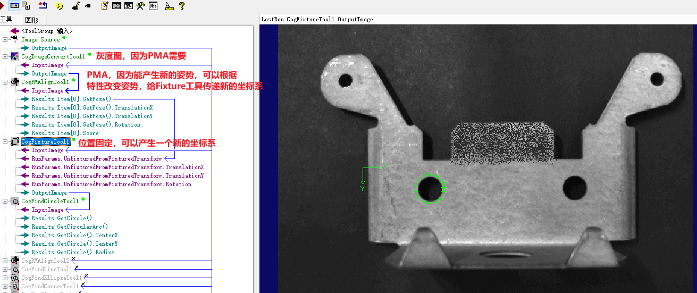 

有了新的坐标系后，我们可以根据新的坐标系找圆，就可以在零件在图像中旋转、移动的时候，都能准确找到圆。

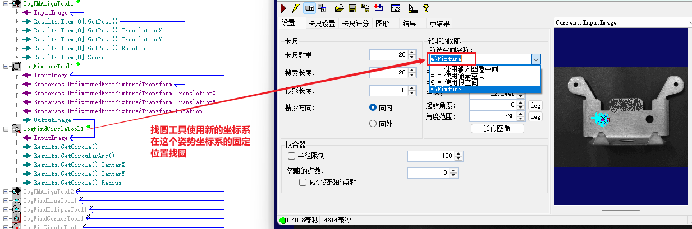 

例如：

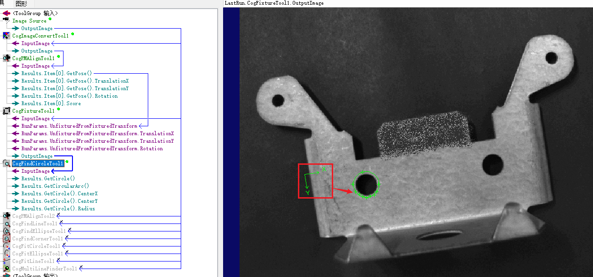 

## 五、几何图形创建

### 1、文本标签

将结果数据通过文本的形式展示在图片中，例如线的长度标注、圆的中心点和半径标注、匹配数量标注。

字符串可以在文本中使用大括号进行格式化输出，大括号中可以使用4个字符：

B：布尔值

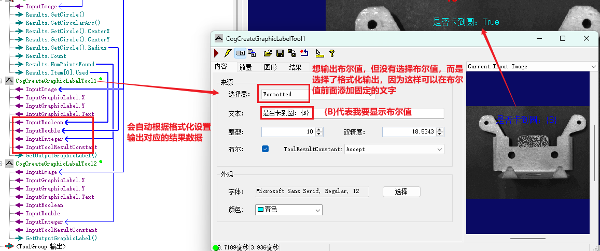 

D：浮点数

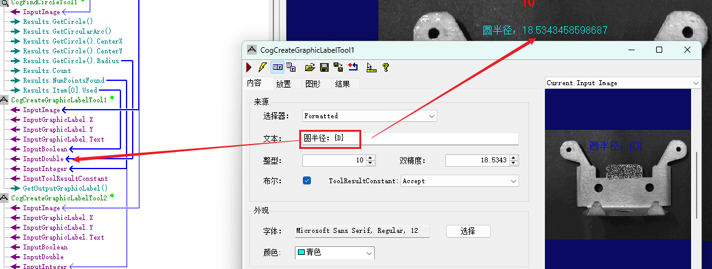 

T：由提供的CogToolResuoltConstants字符串代替

I：整型

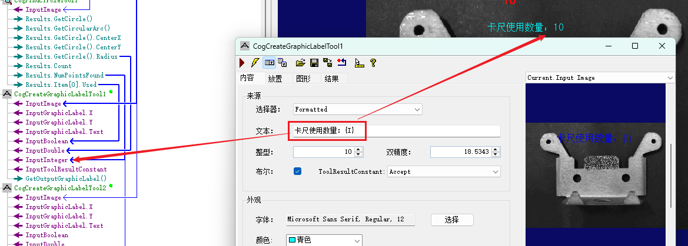 

表示有多个结果的时候，可以利用格式化选择输出。

还可以控制的更加具体：

`{D,对齐方式:格式字符串}`对齐方式可以省略

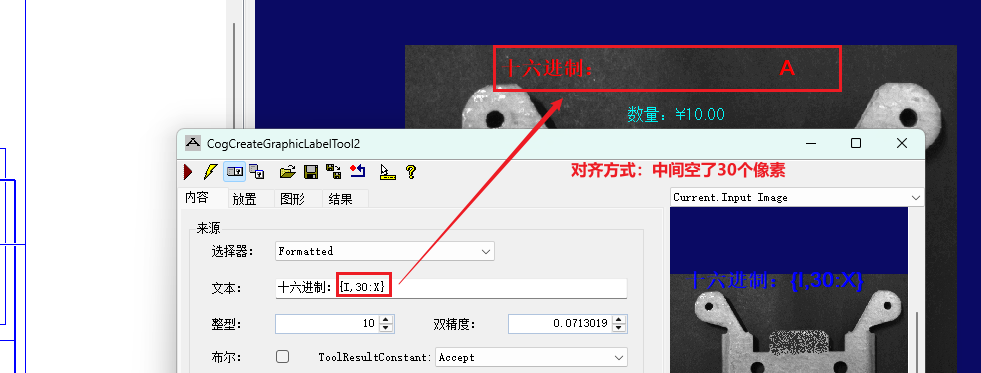 

格式字符串：

C：货币

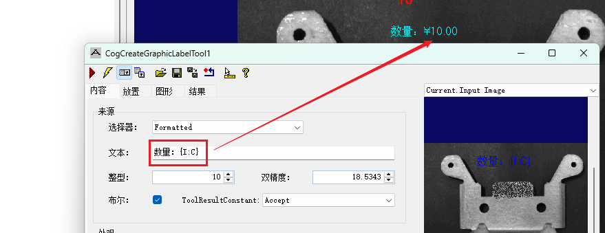 

P：百分数

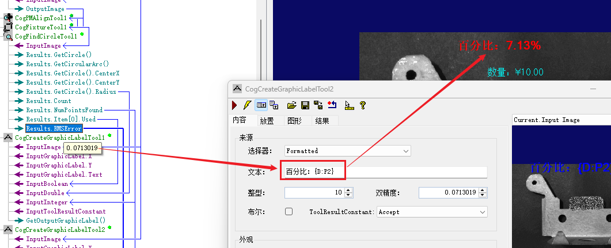 

F：小数位数

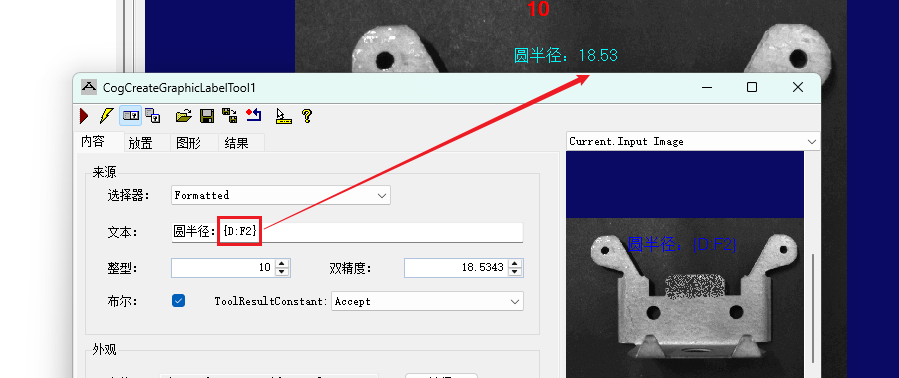 

X：十六进制输出，只支持整数

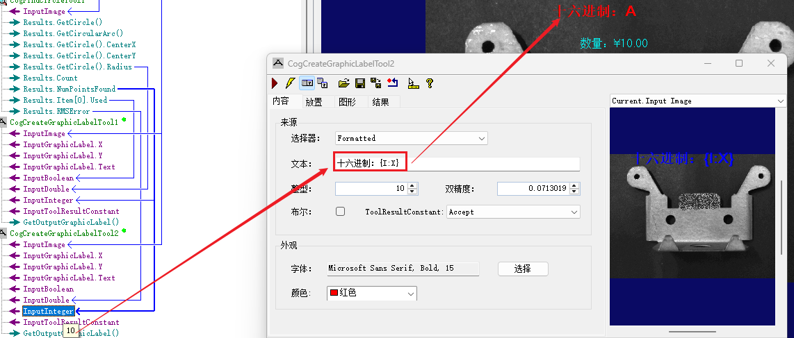 

### 2、线

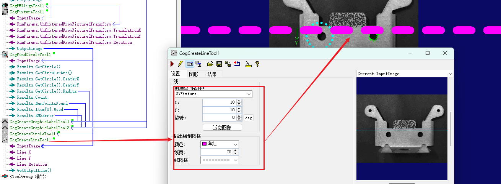 

### 3、圆

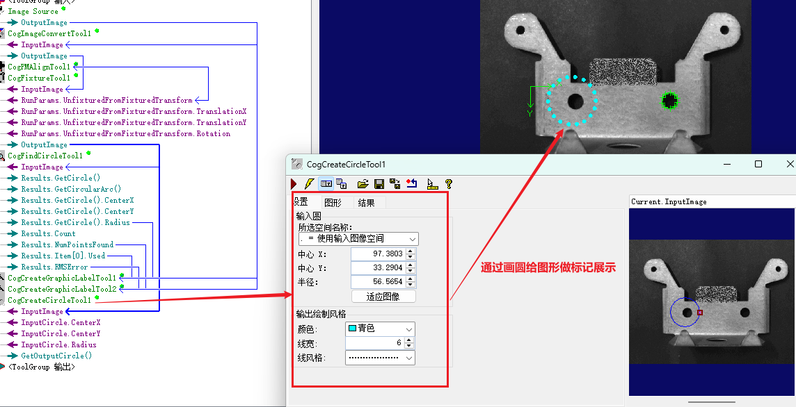 

作业：

使用羊角零件图，在图片上标记零件左边是否合格、右边是否合格，两边都标记上结果

给轴承零件找圆心，并在图片上标记圆心的坐标（x轴和y轴都要），并保留小数点后两位

标记三星电池，在图像上显示结果：正面用两条线画一个对勾；反面用两条线画❌

使用针脚图，检测每组针脚是否合格（合格是，针脚12个，没有掉落，没有弯曲），并将结果标记在图片上

小作业: 

 - 统计每个图中1角5角1元个数(注意: 正反面都要)
 - 统计每个图中总计多少钱,输出